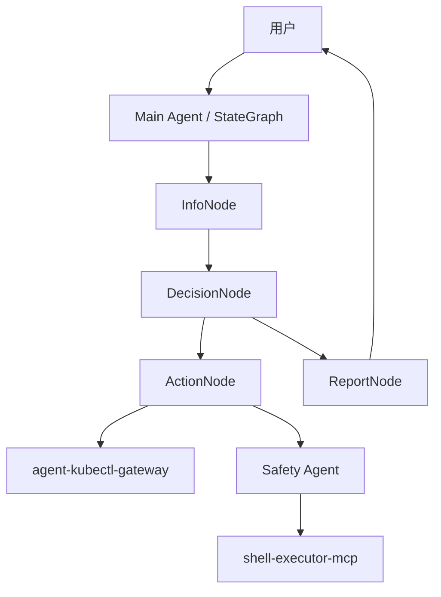

# K8s Analyzer Agent

一个基于 Eino / Go 的 K8s 自动诊断 Agent。

## 项目概述

本项目通过多 Agent 协作完成 Kubernetes 集群诊断：

- **K8s 状态获取**：通过 `agent-kubectl-gateway` 访问集群
- **Shell 命令执行**：通过 `shell-executor-mcp` 执行节点侧命令
- **安全审计**：所有 Shell 命令先经过 `Safety Agent` 审计
- **多步推理**：基于 `Eino StateGraph` 逐轮收集信息并生成报告
- **Skill 中间件**：可按配置加载技能，增强诊断流程
- **监控面板**：提供 9090 端口的监控与 Trace 查看能力

架构细节见：[`docs/architecture-v2.md`](docs/architecture-v2.md)

## 核心设计

- **安全第一**：Shell 命令必须经过审计
- **工具复用**：复用 gateway / MCP 的现有能力
- **上下文精简**：LLM 只接收必要信息
- **失败可恢复**：单个节点失败不应拖垮整个诊断流程

## 总体架构



### 组件说明

- **Main Agent**：负责意图识别、循环决策、信息聚合和报告生成
- **Safety Agent**：对 Shell 命令做规则 + LLM 语义审计
- **Gateway**：提供结构化 K8s 查询/操作能力
- **shell-executor-mcp**：执行节点侧命令
- **Skill Loader**：按配置加载技能目录，扩展诊断能力
- **Monitor**：提供运行监控和 Trace 服务

## 启动与失败策略

- `gateway` 初始化失败：**直接退出**
- `tool cache` 选择 `redis` / `file` 后端且初始化失败：**直接退出**
- `tool cache` 选择 `memory`：可正常启动
- `shell_mcp` 连接失败：当前实现支持降级模式
- `monitor` 默认监听 9090，并写入 `data/traces`

## 目录结构

- `cmd/`：程序入口
- `internal/agent/`：诊断与安全 Agent
- `internal/client/`：Gateway / Shell MCP 客户端
- `internal/store/`：Finding Store 与 ToolCache
- `internal/config/`：配置加载
- `docs/`：架构与设计文档

## 快速开始

### 前置依赖

- Go 1.22+
- 可用的 `agent-kubectl-gateway`
- 可用的 `shell-executor-mcp`
- 可用的 LLM API Key

### 配置文件

默认配置路径：`configs/config.yaml`

示例配置：

```yaml
gateway:
  base_url: "https://localhost:8080"
  auth_token: "${GATEWAY_AUTH_TOKEN}"
  timeout_seconds: 30

shell_mcp:
  server_url: "http://localhost:9090"
  transport: "sse"
  auth_token: "${SHELL_MCP_TOKEN}"

llm:
  light:
    provider: "openai"
    base_url: "https://api.openai.com/v1"
    api_key: "${OPENAI_API_KEY}"
    model: "gpt-4o-mini"
    temperature: 0.1
    max_tokens: 1000
  power:
    provider: "openai"
    base_url: "https://api.openai.com/v1"
    api_key: "${OPENAI_API_KEY}"
    model: "gpt-4o"
    temperature: 0.3
    max_tokens: 4000

store:
  type: "memory"   # memory / redis
  redis:
    host: "localhost"
    port: 6379
    password: ""
    db: 0

agent:
  max_iterations: 10
  compress_threshold: 4
  output_max_lines: 50
  output_max_chars: 3000
  finding_ttl_hours: 1
  verify_recommendations: true
  max_verify_iterations: 2
  tool_cache:
    backend: "memory"  # memory / redis / file
    ttl: "10m"
    file_dir: "data/tool-cache"

monitor:
  api_port: 9090
  trace_dir: "data/traces"

skill:
  enabled: false
  dir: "./skills"
```

### 运行

```bash
go run cmd/k8s-analyzer/main.go --config configs/config.yaml "分析 default 命名空间下 nginx Pod 重启原因"
```

或者构建后运行：

```bash
go build -o bin/k8s-analyzer.exe cmd/k8s-analyzer/main.go
./bin/k8s-analyzer.exe --config configs/config.yaml "分析 default 命名空间下 nginx Pod 重启原因"
```

## 开发说明

- 文档优先：架构变化先同步 `docs/architecture-v2.md`
- 启动入口：`cmd/k8s-analyzer/main.go`
- 监控服务：`cmd/k8s-monitor/main.go`
- 配置优先：`configs/config.yaml` 同步 `skill` / `monitor` / `tool_cache` 段

## 备注

当前 README 以 `docs/architecture-v2.md` 为准，旧版 K8s MCP / Shell 子 Agent 叙述已弃用。
