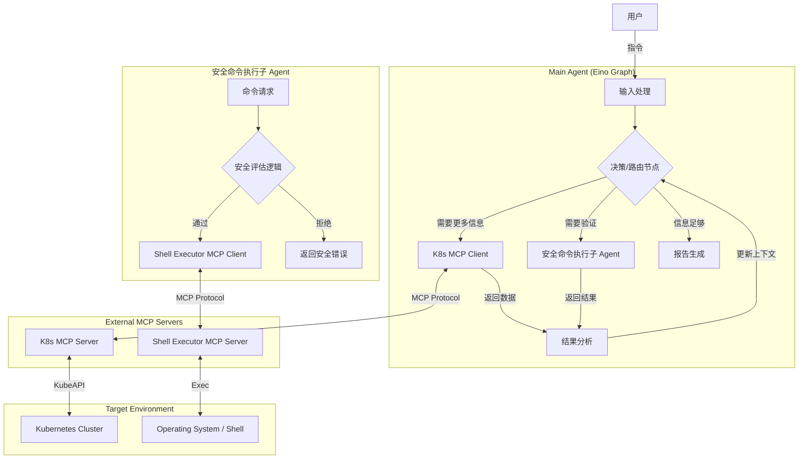

# K8s Analyzer Agent

这是一个基于 Eino 框架 (Golang) 开发的智能分析 Agent，旨在通过集成 MCP (Model Context Protocol) 工具，实现 K8s 集群状态的自动感知、安全诊断与智能分析。

## 项目背景

随着 Kubernetes 集群规模的增长，运维复杂度显著提升。排查问题往往涉及查看多个资源状态、执行诊断命令以及综合分析日志。本项目旨在解决这一痛点，通过智能 Agent 自动化执行这些步骤，提供包含根因分析与修复建议的报告。

## 核心功能

*   **K8s 智能感知**: 自动与 K8s API 交互，获取 Node、Pod、Service、Event 等核心资源的状态信息。
*   **安全诊断执行**: 内置安全子 Agent (Secure Sub-Agent)，对 Shell 诊断命令进行严格的语义分析与安全审计，确保只执行只读、非破坏性的操作（如禁止 `rm`, `mv` 等），防止误操作。
*   **自动化分析报告**: 综合资源状态数据与诊断命令结果，基于 LLM (Large Language Model) 生成清晰的 Markdown 报告，包含问题现状、根因推断及具体的修复建议。
*   **动态工具发现**: 系统启动时自动从 MCP Server 获取可用工具列表，动态注入到 LLM Prompt 中，无需手动维护工具清单。支持严格的启动校验，确保所有 MCP 连接正常且 Token 配置有效。

## 系统架构

系统采用多 Agent 协作模式，通过图 (Graph) 结构编排分析流程。



### 核心组件说明

*   **Main Agent**: 系统的“大脑”，负责意图识别、任务编排 (基于 Eino Graph) 以及最终报告的生成。它决定何时获取信息、何时执行诊断。
*   **Secure Sub-Agent**: 系统的“安全守门员”，负责接收主 Agent 的命令请求，进行安全审计，仅允许安全的命令通过并调用底层的 Shell 执行器。
*   **MCP Clients**:
    *   `k8s-mcp`: 基于 [k8s-mcp](https://github.com/AceDarkknight/k8s-mcp) SDK 实现，用于连接 K8s MCP Server，查询集群资源。
    *   `shell-executor-mcp`: 基于 [shell-executor-mcp](https://github.com/AceDarkknight/shell-executor-mcp) SDK 实现，用于连接 Shell Executor MCP Server，执行诊断命令。

更多架构细节请参考 [docs/architecture.md](docs/architecture.md)。

## 目录结构

*   `cmd/`: 项目入口文件，包含 `main.go`。
*   `internal/`: 私有应用代码库。
    *   `agent/`: Agent 核心逻辑，包含分析 (`analysis`) 和安全 (`safety`) 模块。
    *   `client/`: MCP 客户端实现，包含 K8s 和 Shell 客户端。
*   `docs/`: 项目文档，包含需求文档、架构文档及开发计划。
*   `bin/`: 存放编译后的二进制文件及运行时配置文件。

## 快速开始 (Quick Start)

### 前置依赖

1.  **Go**: 1.22 或更高版本。
2.  **MCP Servers**:
    *   正在运行的 [k8s-mcp](https://github.com/AceDarkknight/k8s-mcp) Server 。
    *   正在运行的 shell-executor-mcp Server。
3.  **LLM API**: 有效的 LLM API Key (如 OpenAI, Gemini, Claude 等)，用于支持 Agent 的智能分析。

### 配置说明

1.  **配置文件**: 
    在 `bin/` 目录下，确保存在以下配置文件并根据实际情况修改：
    *   `bin/k8s_config.json`: 配置 K8s MCP Server 的连接信息（如命令或 SSE 地址）。
    *   `bin/shell_config.json`: 配置 Shell Executor MCP Server 的连接信息。

2.  **环境变量**:
    设置必要的环境变量，例如：
    ```bash
    export OPENAI_API_KEY="your-api-key"
    ```

### 构建指南

在项目根目录下执行以下命令：

```bash
# 整理依赖
go mod tidy

# 构建项目
go build -o bin/k8s-analyzer.exe cmd/k8s-analyzer/main.go
```

### 运行示例

构建成功后，可以使用以下命令运行 Analyzer：

```bash
# 基本用法
./bin/k8s-analyzer.exe --config bin/config.yaml "分析 default 命名空间下 nginx pod 重启的原因"

# 查看帮助
./bin/k8s-analyzer.exe --help
```

## 开发规范

本项目遵循严格的开发流程规范，详情请参考 `docs/plan/` 下的文档。

*   **文档优先**: 所有变更需先更新设计文档。
*   **Code Review**: 所有代码提交需经过审查。
*   **测试驱动**: 保持高单元测试覆盖率。
