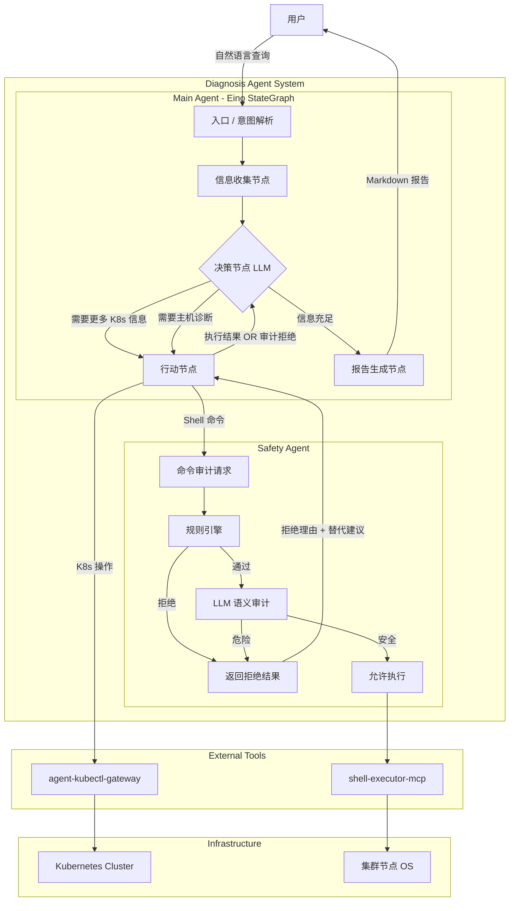
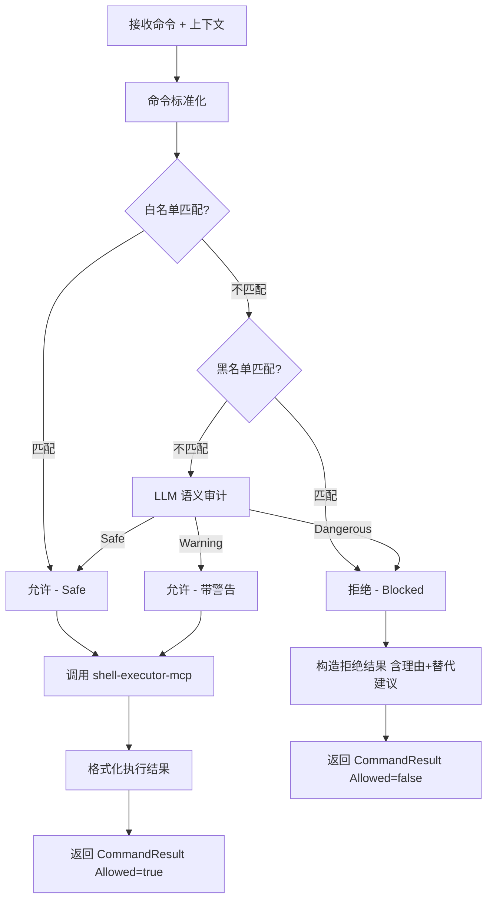

# K8s 诊断 Agent 系统架构设计 V2

> 全新设计，基于 `agent-kubectl-gateway` 和 `shell-executor-mcp` 两个外部工具构建。

---

## 1. 项目概述

构建一个 AI 驱动的 Kubernetes 集群自动诊断系统，通过多 Agent 协作实现：

- **K8s 集群状态自动感知**（via agent-kubectl-gateway）
- **安全可控的主机命令执行**（via shell-executor-mcp + Safety Agent 审计）
- **多步骤智能推理诊断**（via Eino StateGraph）
- **结构化分析报告生成**

### 1.1 核心设计原则

| 原则 | 说明 |
|------|------|
| **安全第一** | 所有命令执行都需经过审计，Shell 命令需 Safety Agent 前置审查 |
| **工具复用** | 不重复造轮子，充分利用 gateway 和 MCP 已有的安全机制 |
| **上下文精简** | State ≠ LLM 输入，每次 LLM 调用只传必要信息 |
| **失败可恢复** | 每个 Agent 独立容错，主流程不因单个工具失败而崩溃 |

---

## 2. 外部工具能力分析

### 2.1 agent-kubectl-gateway

```
AI Agent → HTTP POST /execute → Gateway → kubectl → K8s Cluster
```

**已内置安全能力**（无需 Agent 侧重复实现）：
- ✅ 结构化输入（verb/resource/namespace），防 Shell 注入
- ✅ 动词白名单/黑名单（如禁止 `delete`、`exec`）
- ✅ Secret 输出自动脱敏
- ✅ 输出长度截断（防 Token 超限）
- ✅ 审计日志（完整请求生命周期）
- ✅ 并发控制 + 超时控制

**Agent 侧需要做的**：
- 将 LLM 的自然语言意图转换为结构化 JSON 请求
- 解析返回结果并注入诊断上下文

### 2.2 shell-executor-mcp

```
Agent → MCP Client → SSE → MCP Server (Coordinator) → 集群节点执行
```

**已内置安全能力**：
- ✅ 命令黑名单（正则匹配危险命令）
- ✅ Token 鉴权（集群内部通信）
- ✅ 结果聚合（相同结果节点自动合并）

**Agent 侧需要补充的**（核心需求）：
- ⚠️ **语义级命令审计**：MCP 仅有黑名单，缺少"理解命令意图"的能力
- ⚠️ **上下文感知审计**：需要知道"为什么要执行这个命令"
- ⚠️ **动态风险评估**：`rm` 显然危险，但 `find / -name "*" -delete` 这类需要语义理解

→ 这就是 **Safety Agent** 存在的意义。

---

## 3. 总体架构



> **关键设计**：Safety Agent 拒绝命令后，**不会终止诊断流程**。拒绝结果（包含理由和替代命令建议）作为 Observation 回传到 ActionNode，再流转到 DecisionNode，由 LLM 决定换一个更安全的命令或判断已有信息足够直接出报告。

---

## 4. Agent 职责划分

### 4.1 Main Agent

Main Agent 是系统的核心编排者，基于 Eino StateGraph 实现 OODA 循环。

**职责**：
- 解析用户自然语言意图
- 编排多步骤诊断流程（循环决策）
- 路由工具调用（K8s 操作 → Gateway，Shell 命令 → Safety Agent）
- 聚合分析结果，生成最终报告

**Graph 节点设计**：

| 节点 | 职责 | 调用目标 |
|------|------|---------|
| `InfoNode` | 初始信息收集（Pod/Deployment/Namespace 等） | agent-kubectl-gateway |
| `DecisionNode` | LLM 决策下一步行动（含轻量规划） | LLM (Light) |
| `ActionNode` | 执行工具调用（continue 模式）或委托 ReAct 深度分析（deep_query 模式） | Gateway / Safety Agent / ReAct LLM |
| `CompressNode` | 条件触发：压缩过长的推理历史 | 规则 / LLM (Light) |
| `ReportNode` | 生成最终诊断报告 | LLM (Power) |

**StateGraph 流程**：

```
START
  ↓
InfoNode（收集基础 K8s 状态）
  ↓
DecisionNode（LLM 分析并决策，含轻量规划）
  ├─ "continue"   → ActionNode（按 tool_calls 逐一执行）→ CompressNode → DecisionNode
  ├─ "deep_query" → ActionNode（委托 ReAct LLM 自主深度调查）→ CompressNode → DecisionNode
  └─ "report"     → ReportNode → END
```

**三种决策的区别**：

| 决策 | 场景 | ActionNode 行为 |
|------|------|----------------|
| `continue` | 明确知道要调哪些工具（如“查看日志”“查看 Events”） | 按 `tool_calls` 列表逐一执行，收集 Observation |
| `deep_query` | 需要多步关联调查，无法预先确定步骤（如“这个 Pod 的网络是否有问题”） | 将 `deep_query_topic` 委托给 ReAct LLM，由它自主决定调查步骤 |
| `report` | 信息充足或达到 MaxIterations | 跳过 ActionNode，直接进入 ReportNode |

> `CompressNode` 不是每轮都执行——仅当 `len(ReasoningHistory) > CompressThreshold`（默认 4）时触发，否则直接跳过。

### 4.2 Safety Agent（独立 Agent）

Safety Agent 是 Shell 命令的**前置审计网关**，位于 Main Agent 和 shell-executor-mcp 之间。

```
Main Agent → Safety Agent → shell-executor-mcp → 节点执行
                 │
                 ├── 规则引擎（快速拦截）
                 └── LLM 审计（语义理解）
```

**职责**：
1. **接收** Main Agent 发出的 Shell 命令请求
2. **规则审计** 通过黑名单/白名单快速判断
3. **语义审计** 对规则无法判定的命令，调用 LLM 进行语义级安全评估
4. **执行代理** 审计通过后，调用 shell-executor-mcp 执行命令
5. **结果返回** 将执行结果（stdout/stderr/exitCode）格式化后返回 Main Agent

**为什么需要独立 Agent，而不是放在 Main Agent 内部？**

| 维度 | 独立 Agent | 嵌入 Main Agent |
|------|-----------|----------------|
| 单一职责 | ✅ 只负责审计+执行 | ❌ 混合诊断逻辑和安全逻辑 |
| 可独立测试 | ✅ 可单独测试审计逻辑 | ❌ 需要完整 Graph 环境 |
| LLM 配置独立 | ✅ 审计用小模型，节省成本 | ❌ 共享模型配置 |
| 可复用 | ✅ 其他系统也可调用 | ❌ 紧耦合 |
| 安全边界清晰 | ✅ 强制所有命令经过审计 | ❌ 可能被绕过 |

---

## 5. Safety Agent 详细设计

### 5.1 审计流程



> 无论审计通过还是拒绝，Safety Agent 都返回 `CommandResult`，区别在于 `AuditInfo.Allowed` 字段。ActionNode 据此将结果写入 Observation，DecisionNode 在下一轮迭代中可以看到拒绝原因和替代建议。

### 5.5 审计拒绝后的闭环流程

当 Safety Agent 拒绝一条命令时，完整的反馈闭环如下：

```
DecisionNode: 决定执行 "rm -rf /tmp/old-logs" 清理空间
     |
ActionNode: 发送命令到 Safety Agent
     |
Safety Agent:
  - 规则引擎: "rm -rf" 匹配黑名单 -> 拒绝
  - 返回: Allowed=false, Reason="rm -rf 属于高危操作",
          Advice="建议使用 du -sh /tmp/old-logs 先查看大小"
     |
ActionNode:
  - 记录 CommandExecution (success=false)
  - 写入 Observation: "命令被安全审计拒绝。原因: rm -rf 高危。建议: du -sh 查看大小"
     |
DecisionNode（下一轮迭代）:
  - LLM 看到拒绝记录和替代建议
  - 决策: continue, tool_calls: execute_safe_command "du -sh /tmp/old-logs"
     |
ActionNode: 发送 "du -sh /tmp/old-logs" -> Safety Agent 审计通过 -> 执行成功
```

**关键点**：
- 拒绝 **不等于** 流程终止，而是反馈循环的一环
- LLM 在 DecisionNode 中能看到拒绝原因和替代建议，据此调整策略
- 如果连续多次被拒绝或达到 MaxIterations，DecisionNode 会自动切换到 `report`，在报告中标注"部分诊断因安全限制未完成"

### 5.2 接口设计

```go
// SafetyAgent 安全命令执行 Agent
type SafetyAgent interface {
    // ExecuteSafeCommand 审计并执行命令
    // command: 待执行的 Shell 命令
    // context: 审计上下文（谁在调用、为什么要执行）
    // 返回: 执行结果或审计拒绝错误
    ExecuteSafeCommand(ctx context.Context, req *CommandRequest) (*CommandResult, error)
}

// CommandRequest 命令请求
type CommandRequest struct {
    Command     string            // Shell 命令
    Reason      string            // 执行原因（来自 LLM 的推理）
    Source      string            // 调用来源（如 "ActionNode"）
    Iteration   int               // 当前诊断迭代轮次
    ContextInfo map[string]string // 额外上下文
}

// CommandResult 命令执行结果
type CommandResult struct {
    Stdout     string       // 标准输出
    Stderr     string       // 标准错误
    ExitCode   int          // 退出码
    AuditInfo  *AuditInfo   // 审计信息
    NodeResults []NodeResult // 集群多节点结果（来自 MCP 聚合）
}

// AuditInfo 审计信息
type AuditInfo struct {
    Allowed     bool   // 是否通过
    SafetyLevel string // safe / warning / dangerous
    Reason      string // 审计理由
    Advice      string // 建议（如有更安全的替代命令）
    Method      string // 审计方法：rule / llm
}
```

### 5.3 规则引擎

```yaml
# safety_rules.yaml
whitelist:
  # 这些命令总是安全的，跳过 LLM 审计
  commands:
    - "cat"
    - "head"
    - "tail"
    - "grep"
    - "awk"
    - "wc"
    - "df"
    - "du"
    - "free"
    - "uptime"
    - "top -bn1"
    - "ps aux"
    - "netstat"
    - "ss"
    - "ip addr"
    - "ip route"
    - "ping"
    - "traceroute"
    - "dig"
    - "nslookup"
    - "curl -I"
    - "crictl ps"
    - "crictl logs"
    - "docker ps"
    - "docker logs"
    - "dmesg"
    - "journalctl"

blacklist:
  # 这些模式总是被拒绝，不进入 LLM 审计
  patterns:
    - "rm\\s+-rf"
    - "rm\\s+-r"
    - "mkfs"
    - "dd\\s+if="
    - "shutdown"
    - "reboot"
    - "init\\s+[0-6]"
    - "chmod\\s+777"
    - "chown\\s+-R"
    - "iptables\\s+-F"
    - "systemctl\\s+stop"
    - "systemctl\\s+disable"
    - "kill\\s+-9"
    - "pkill"
    - ">\\s*/dev/"
    - "curl.*\\|.*sh"
    - "wget.*\\|.*sh"
    - "eval"
    - "exec"
    - "\\$\\("           # 命令替换
    - "`"                # 反引号命令替换
    - "\\|\\s*bash"
    - "\\|\\s*sh"
```

### 5.4 LLM 审计 Prompt

```
你是一个 Linux 命令安全审计专家。请评估以下命令的安全性。

## 命令
{command}

## 执行原因
{reason}

## 评估规则
1. 只读命令（查看文件、查询状态、网络探测）→ Safe
2. 可能影响系统但可控（如 systemctl status、docker inspect）→ Warning
3. 会修改/删除文件、停止服务、更改权限、执行远程代码 → Dangerous

## 输出格式（严格 JSON）
{
  "safety_level": "safe" | "warning" | "dangerous",
  "reason": "判断理由",
  "advice": "如有更安全的替代命令，请在此建议"
}
```

---

## 6. 数据流设计

### 6.1 State 结构（Graph 流转状态）

```go
type State struct {
    // 用户输入
    UserInput string

    // K8s 信息（从 Gateway 获取）
    K8sInfo *K8sInfo

    // 诊断过程
    ReasoningHistory    []ReasoningStep // 完整推理链
    CompressedSummary   string          // 被压缩的早期步骤摘要
    CompressThreshold   int             // 触发压缩的历史长度阈值（默认 4）
    IterationCount      int
    MaxIterations       int             // 默认 10

    // 分析结果
    AnalysisResult *AnalysisResult

    // 错误跟踪
    LastError  error
    LastAction string
}
```

### 6.2 LLM 输入控制

> **核心原则：State 是系统完整状态，LLM Prompt 只取必要子集。**

每个节点的 LLM 调用，只传递该节点需要的最小上下文：

| 节点 | LLM 输入内容 | 不传的内容 |
|------|-------------|-----------|
| `DecisionNode` | 用户查询 + 推理历史摘要 + 当前资源概况 + 异常 Pod 列表 | 全量日志、原始 JSON |
| `ActionNode` | 不调用 LLM | — |
| `ReportNode` | 用户查询 + Findings 列表 + 命令执行摘要 + 资源摘要 | 原始 MCP 返回、中间状态 |
| `Safety LLM Audit` | 单条命令 + 执行原因 | 完整 State |

### 6.3 日志摘要化

从 Gateway 或 MCP 返回的日志/输出在进入 LLM Prompt 前，必须经过摘要处理：

```go
type OutputSummarizer struct {
    MaxLines  int // 最大行数（默认 50）
    MaxChars  int // 最大字符数（默认 3000）
}

func (s *OutputSummarizer) Summarize(output string) string {
    // 1. 按行分割
    // 2. 去除空行和重复行
    // 3. 优先保留包含 ERROR/WARN/FATAL/panic 的行
    // 4. 截断到 MaxChars
    // 5. 附加 "[输出已摘要，原始 N 行 / 显示 M 行]"
}
```

### 6.4 上下文压缩策略

随着诊断迭代增加，`ReasoningHistory` 线性增长，如果全部传入 DecisionNode 的 Prompt 会导致：
- Token 消耗膨胀（每轮 ~500 tokens，10 轮 = 5000 tokens 仅历史）
- Light 模型上下文窗口压力
- LLM 注意力在长历史中稀释，影响决策质量

**解决方案：两级压缩，CompressNode 条件触发**

#### 第一级：规则化滑动窗口（零成本，默认启用）

当 `len(ReasoningHistory) > CompressThreshold` 时，对早期步骤做规则化压缩：

```go
// CompressNode 上下文压缩节点
type CompressNode struct {
    llm              LLM  // 可选，用于 LLM 压缩
    compressThreshold int  // 触发阈值（默认 4）
    recentKeep        int  // 保留最近 N 轮完整（默认 3）
}

func (n *CompressNode) Execute(ctx context.Context, state *State) (*State, error) {
    history := state.ReasoningHistory

    // 未达阈值，跳过压缩
    if len(history) <= n.compressThreshold {
        return state, nil
    }

    // 将早期步骤压缩为摘要
    earlySteps := history[:len(history)-n.recentKeep]
    state.CompressedSummary = ruleSummarize(earlySteps)

    // 只保留最近 N 轮完整历史
    state.ReasoningHistory = history[len(history)-n.recentKeep:]

    return state, nil
}

// ruleSummarize 规则化摘要（不调用 LLM）
func ruleSummarize(steps []ReasoningStep) string {
    var sb strings.Builder
    for _, step := range steps {
        // 只保留：决策 + 关键发现，丢弃原始观察数据
        sb.WriteString(fmt.Sprintf(
            "步骤%d: %s → %s\n",
            step.Iteration,
            step.Decision,
            extractKeyFinding(step.Observation),  // 提取关键行（ERROR/异常）
        ))
    }
    return sb.String()
}
```

**效果示例**：

| 迭代 | 历史长度 | 压缩行为 | DecisionNode 输入 |
|------|---------|---------|------------------|
| 1-4 | ≤ 4 | 不压缩 | 完整 4 轮历史 |
| 5 | 5 | 压缩步骤 1-2 | 摘要(2轮) + 完整(3轮) |
| 8 | 8→3 | 压缩步骤 1-5 | 摘要(5轮) + 完整(3轮) |

#### 第二级：LLM 压缩（可选，仅当 MaxIterations > 10 时推荐）

对于特别复杂的诊断（如调高 `MaxIterations` 到 15-20），规则化摘要可能不够精确。此时 CompressNode 可调用 Light LLM 生成更高质量的摘要：

```go
func (n *CompressNode) llmSummarize(ctx context.Context, steps []ReasoningStep) (string, error) {
    prompt := fmt.Sprintf(
        "请将以下 K8s 诊断推理历史压缩为 200 字以内的摘要，保留关键发现和决策：\n%s",
        formatSteps(steps),
    )
    return n.llm.Generate(ctx, prompt)
}
```

触发条件：`len(earlySteps) > 6 && llm != nil`，否则回退到规则化摘要。

#### DecisionNode Prompt 集成

DecisionNode 构建 Prompt 时，使用压缩后的上下文：

```go
func buildDecisionPrompt(state *State) string {
    var sb strings.Builder

    // ... 用户查询、角色描述 ...

    // 压缩摘要（如果有）
    if state.CompressedSummary != "" {
        sb.WriteString("## 早期调查摘要\n")
        sb.WriteString(state.CompressedSummary)
        sb.WriteString("\n\n")
    }

    // 最近步骤（完整）
    sb.WriteString("## 最近推理步骤\n")
    for _, step := range state.ReasoningHistory {
        // 完整展示 Thought + Decision + ToolCalls + Observation
    }

    // ... 当前资源、任务指令 ...
}
```

### 6.5 DecisionNode 轻量规划引导

不需要独立 Plan Agent，但在 DecisionNode 的 Prompt 中引导 LLM 自带规划：

```
## Thought 格式要求
你的 thought 必须包含以下三部分：
1. **当前认知**：基于已有信息，目前了解到什么？
2. **初步计划**：接下来打算按什么顺序调查？（列出 2-3 步）
3. **本轮行动**：这一轮具体执行计划中的哪一步？

注意：计划是动态的，每轮根据新发现调整。
```

**示例 LLM 输出**：
```json
{
  "thought": "当前认知: nginx Pod 处于 CrashLoopBackOff，重启 15 次。初步计划: 1) 查看 Pod 日志 2) 查看 Events 3) 检查磁盘/内存。本轮行动: 执行计划第 1 步，查看日志。",
  "decision": "continue",
  "tool_calls": [{"name": "get_pod_logs", ...}]
}
```

这样 LLM 自然会形成连贯的调查思路，而不需要额外的 Plan Agent。

---

## 7. 工具调用层设计

### 7.1 Gateway Client（K8s 操作）

封装 agent-kubectl-gateway 的 HTTP REST API 调用：

```go
type GatewayClient struct {
    baseURL    string
    httpClient *http.Client
    authToken  string
}

// KubectlRequest Gateway 请求结构（与 Gateway API 对齐）
type KubectlRequest struct {
    Verb      string          `json:"verb"`
    Resource  string          `json:"resource"`
    Namespace string          `json:"namespace"`
    Name      string          `json:"name,omitempty"`
    Options   *KubectlOptions `json:"options,omitempty"`
    Output    string          `json:"output,omitempty"`
    Mode      string          `json:"mode"`  // 固定 "structured"
}

// Execute 执行 kubectl 命令
func (c *GatewayClient) Execute(ctx context.Context, req *KubectlRequest) (*KubectlResponse, error)

// 便捷方法
func (c *GatewayClient) ListPods(ctx context.Context, ns string, labels string) (*KubectlResponse, error)
func (c *GatewayClient) DescribePod(ctx context.Context, ns, name string) (*KubectlResponse, error)
func (c *GatewayClient) GetLogs(ctx context.Context, ns, pod, container string, tailLines int) (*KubectlResponse, error)
func (c *GatewayClient) ListEvents(ctx context.Context, ns string) (*KubectlResponse, error)
func (c *GatewayClient) ListDeployments(ctx context.Context, ns string) (*KubectlResponse, error)
func (c *GatewayClient) GetNodes(ctx context.Context) (*KubectlResponse, error)
```

### 7.2 MCP Client（Shell 执行）

封装 shell-executor-mcp 的 MCP SSE 连接：

```go
type ShellMCPClient struct {
    mcpClient *mcp.Client
    serverURL string
}

// ExecuteCommand 通过 MCP 执行命令
func (c *ShellMCPClient) ExecuteCommand(ctx context.Context, command string) (*ExecuteResult, error)

// ExecuteResult MCP 执行结果
type ExecuteResult struct {
    Results []NodeExecuteResult // 多节点结果
}

type NodeExecuteResult struct {
    NodeID   string
    Stdout   string
    Stderr   string
    ExitCode int
}
```

---

## 8. LLM 配置设计

### 8.1 两级模型

```go
type LLMConfig struct {
    Provider    string  `json:"provider"`     // openai / deepseek / gemini
    BaseURL     string  `json:"base_url"`
    APIKey      string  `json:"api_key"`      // 建议从环境变量读取
    Model       string  `json:"model"`
    Temperature float64 `json:"temperature"`
    MaxTokens   int     `json:"max_tokens"`
}

type AgentLLMConfig struct {
    // 轻量模型：决策、分类、命令安全审计
    Light LLMConfig `json:"light"`
    // 强力模型：深度分析、报告生成
    Power LLMConfig `json:"power"`
}
```

### 8.2 模型分配策略

| 调用场景 | 模型 | 理由 |
|---------|------|------|
| `DecisionNode` 决策 | Light | 输出结构简单（JSON），小模型足够 |
| `Safety Agent` LLM 审计 | Light | 单条命令安全评估，不需要复杂推理 |
| `ReActLLM` 深度分析 | Power | 需要理解 K8s 概念 + 日志分析 + 根因推理 |
| `ReportNode` 报告生成 | Power | 需要综合多源信息 + 结构化输出 |

---

## 9. 异常处理设计

### 9.1 分层容错

```
┌─────────────────────────────────┐
│        Main Agent (Graph)       │
│  MaxIterations = 10 防死循环    │
│  defer-recover 防 Panic         │
├─────────────────────────────────┤
│     Gateway Client              │
│  重试 3 次 + 指数退避           │
│  不可用 → 返回错误              │
├─────────────────────────────────┤
│     Safety Agent                │
│  规则引擎 → 零延迟             │
│  LLM 审计超时 → 降级到规则     │
├─────────────────────────────────┤
│     MCP Client                  │
│  重试 3 次 + 指数退避           │
│  不可用 → 降级模式（仅 K8s）   │
└─────────────────────────────────┘
```

### 9.2 关键异常处理

| 异常 | 处理方式 |
|------|---------|
| Gateway 连接失败 | 启动时 Fatal；运行时重试 3 次后返回错误 |
| MCP 连接失败 | 启动时 Warn + 降级模式；运行时跳过 Shell 命令，报告中标注 |
| LLM 调用失败 | DecisionNode → 降级到规则引擎；ReportNode → 使用模板报告 |
| LLM 输出格式错误 | 自我修正重试 2 次 → 回退到文本解析 |
| 命令执行超时 | 记录为 Failed，继续下一步 |
| 审计 LLM 超时 | 降级到纯规则判断 |

---

## 10. 可观测性

### 10.1 结构化日志

所有组件使用 `zap` 结构化日志，关键日志点：

| 组件 | 日志事件 | 级别 |
|------|---------|------|
| Main Agent | Graph 节点进入/退出、迭代计数 | Info |
| DecisionNode | LLM 决策结果、推理内容 | Info |
| ActionNode | 工具调用名称、参数、结果摘要 | Info |
| Safety Agent | 审计结果（allow/deny）、方法（rule/llm）、命令 | Info/Warn |
| Gateway Client | 请求/响应、延迟、状态码 | Debug/Info |
| MCP Client | 连接状态、命令执行、节点结果 | Debug/Info |

### 10.2 诊断 Trace

每次诊断任务生成完整的推理链（`ReasoningHistory`），包含：

```go
type ReasoningStep struct {
    Iteration   int        // 迭代轮次
    Timestamp   time.Time  // 时间戳
    Thought     string     // LLM 推理过程
    Decision    string     // continue / report
    ToolCalls   []ToolCall // 工具调用列表
    Observation string     // 执行结果摘要
    Duration    time.Duration // 该步骤耗时
    TokensUsed  int        // Token 消耗
}
```

---

## 11. 项目目录结构

```
k8s-analyzer-agent/
├── cmd/
│   └── k8s-analyzer/
│       └── main.go                  # 程序入口
│
├── internal/
│   ├── agent/                       # Agent 层
│   │   ├── diagnosis/               # Main Agent（诊断编排）
│   │   │   ├── agent.go             #   Agent 入口 + Run()
│   │   │   ├── graph.go             #   StateGraph 构建
│   │   │   ├── info_node.go         #   信息收集节点
│   │   │   ├── decision_node.go     #   决策节点
│   │   │   ├── action_node.go       #   行动节点（continue/deep_query 路由）
│   │   │   ├── compress_node.go     #   上下文压缩节点
│   │   │   └── report_node.go       #   报告生成节点
│   │   │
│   │   └── safety/                  # Safety Agent
│   │       ├── agent.go             #   审计 + 执行入口
│   │       ├── rules.go             #   规则引擎（黑名单/白名单）
│   │       └── llm_auditor.go       #   LLM 语义审计
│   │
│   ├── client/                      # 外部工具客户端
│   │   ├── gateway/                 # agent-kubectl-gateway 客户端
│   │   │   ├── client.go            #   HTTP REST 客户端
│   │   │   └── types.go             #   请求/响应结构体
│   │   │
│   │   └── shellmcp/                # shell-executor-mcp 客户端
│   │       ├── client.go            #   MCP SSE 客户端
│   │       └── types.go             #   MCP 结果类型
│   │
│   ├── llm/                         # LLM 层
│   │   ├── router.go                #   Light / Power 模型路由
│   │   ├── react_llm.go             #   ReAct Agent 实现
│   │   ├── prompts.go               #   所有 Prompt 模板
│   │   └── parser.go                #   LLM 输出解析
│   │
│   ├── state/                       # 状态管理
│   │   ├── state.go                 #   State 定义
│   │   └── types.go                 #   K8sInfo/Finding/Result 等
│   │
│   ├── store/                       # 存储层
│   │   ├── finding_store.go         #   FindingStore 接口
│   │   ├── memory_store.go          #   内存实现
│   │   └── redis_store.go           #   Redis 实现
│   │
│   ├── summarizer/                  # 输出摘要
│   │   └── summarizer.go            #   日志/输出摘要器
│   │
│   ├── config/                      # 配置
│   │   └── config.go                #   全局配置（LLM/Gateway/MCP/Store）
│   │
│   └── logger/                      # 日志
│       └── logger.go                #   zap 结构化日志
│
├── configs/
│   ├── config.yaml                  # 主配置文件
│   └── safety_rules.yaml            # 安全审计规则
│
├── docs/                            # 文档
│
├── go.mod
└── go.sum
```

---

## 12. 配置文件设计

```yaml
# config.yaml

# agent-kubectl-gateway 连接配置
gateway:
  base_url: "https://localhost:8080"
  auth_token: "${GATEWAY_AUTH_TOKEN}"  # 从环境变量读取
  timeout_seconds: 30

# shell-executor-mcp 连接配置
shell_mcp:
  server_url: "http://localhost:9090"
  transport: "sse"                     # SSE 传输
  auth_token: "${SHELL_MCP_TOKEN}"

# LLM 配置
llm:
  light:
    provider: "openai"
    base_url: "https://api.openai.com/v1"
    api_key: "${OPENAI_API_KEY}"
    model: "gpt-4o-mini"
    temperature: 0.1
    max_tokens: 1000
  power:
    provider: "openai"
    base_url: "https://api.openai.com/v1"
    api_key: "${OPENAI_API_KEY}"
    model: "gpt-4o"
    temperature: 0.3
    max_tokens: 4000

# Store 配置
store:
  type: "memory"   # memory / redis
  redis:
    host: "localhost"
    port: 6379
    password: ""
    db: 0

# Agent 行为配置
agent:
  max_iterations: 10        # 最大诊断迭代次数
  output_max_lines: 50      # 输出摘要最大行数
  output_max_chars: 3000    # 输出摘要最大字符数
  finding_ttl_hours: 1      # Finding 去重 TTL
```

---

## 13. 核心流程示例

### 13.1 正常流程

用户输入："分析 default 命名空间下 nginx Pod 频繁重启的原因"

```
[InfoNode]
  |- Gateway: POST /execute {verb: "get", resource: "pods", namespace: "default"}
  |- Gateway: POST /execute {verb: "get", resource: "deployments", namespace: "default"}
  +- 结果: 发现 nginx-xxx Pod 状态 CrashLoopBackOff, 重启 15 次

[DecisionNode] (Light LLM)
  |- 输入: 用户查询 + Pod 异常摘要
  +- 决策: continue, tool_calls: [get_pod_logs, list_events]

[ActionNode]
  |- Gateway: POST /execute {verb: "logs", resource: "pod", name: "nginx-xxx", options: {tailLines: 100}}
  +- Gateway: POST /execute {verb: "get", resource: "events", namespace: "default"}

[DecisionNode] (Light LLM)
  |- 输入: 用户查询 + 推理历史 + 日志摘要 + 事件摘要
  +- 决策: continue, tool_calls: [execute_safe_command: "df -h"]

[ActionNode]
  |- Safety Agent 审计 "df -h"
  |   |- 规则引擎: df 在白名单 -> Safe, 跳过 LLM 审计
  +- shell-executor-mcp: 执行 "df -h" -> 返回磁盘使用情况

[DecisionNode] (Light LLM)
  +- 决策: report（信息充足）

[ReportNode] (Power LLM)
  |- 输入: 用户查询 + Findings + 命令摘要 + K8s 资源摘要
  +- 输出: Markdown 诊断报告
```

### 13.2 审计拒绝后自动调整

```
[DecisionNode] (Light LLM) -- 第 3 轮迭代
  |- 推理: 日志显示磁盘空间不足，需要清理临时文件确认
  +- 决策: continue, tool_calls: [execute_safe_command: "rm -rf /tmp/nginx-cache/*"]

[ActionNode]
  |- Safety Agent 审计 "rm -rf /tmp/nginx-cache/*"
  |   |- 规则引擎: "rm -rf" 匹配黑名单 -> DENY
  |   +- 返回: Allowed=false, Reason="rm -rf 高危",
  |            Advice="建议: du -sh /tmp/nginx-cache/ 查看大小"
  +- Observation: "命令被安全审计拒绝。原因: rm -rf 高危。建议: du -sh 查看大小"

[DecisionNode] (Light LLM) -- 第 4 轮迭代
  |- 推理: 上一步被拒绝，采纳审计建议改用 du -sh
  +- 决策: continue, tool_calls: [execute_safe_command: "du -sh /tmp/nginx-cache/"]

[ActionNode]
  |- Safety Agent 审计 "du -sh /tmp/nginx-cache/"
  |   +- 规则引擎: du 在白名单 -> ALLOW
  +- shell-executor-mcp: 执行成功 -> 返回 "4.2G /tmp/nginx-cache/"

[DecisionNode] (Light LLM) -- 第 5 轮迭代
  +- 决策: report（已确认磁盘占用原因，信息充足）

[ReportNode] (Power LLM)
  +- 报告中包含:
     - Finding: "nginx-cache 目录占用 4.2G，导致磁盘空间不足"
     - Recommendation: "手动清理 /tmp/nginx-cache/（需运维人员操作）"
     - 注: "系统已阻止自动清理操作 rm -rf，需人工确认后执行"
```

---

## 14. 关键设计总结

### ✅ 必须做到

| 项目 | 说明 |
|------|------|
| 安全分层 | Gateway 结构化防注入 + MCP 黑名单 + Safety Agent 审计 = 三层安全 |
| 上下文精简 | 每个 LLM 调用只传最小必要信息 |
| 日志摘要化 | 大输出进入 Prompt 前必须摘要 |
| 模型分级 | Light 做决策/审计，Power 做分析/报告 |
| 独立 Safety Agent | Shell 命令强制经过语义审计 |

### ❌ 必须避免

| 项目 | 说明 |
|------|------|
| LLM 直接生成命令字符串传给 Gateway | Gateway 要求结构化输入，不接受原始字符串 |
| 全量日志进入 Prompt | 必须摘要化 |
| 绕过 Safety Agent 直接调用 MCP | 所有 Shell 命令必须经过审计 |
| 单模型处理所有任务 | 浪费成本，小任务用小模型 |
