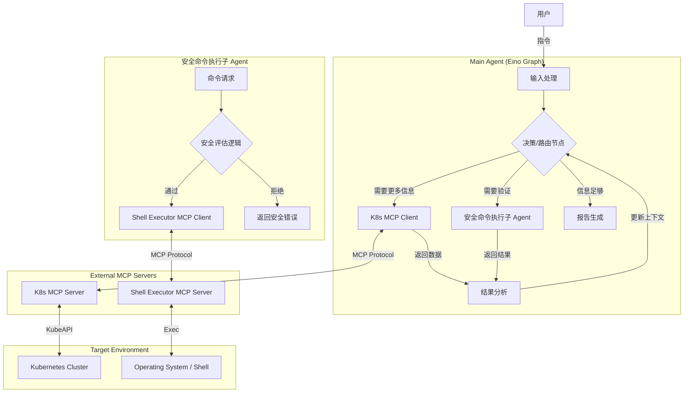
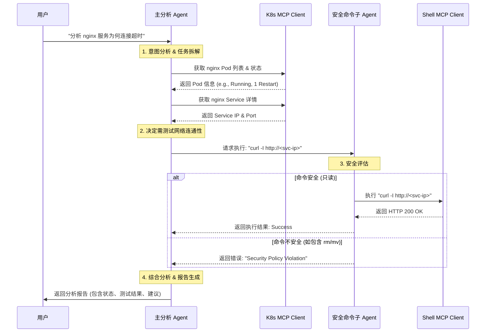

# 架构文档 (Architecture Document)

## 1. 系统概览

K8s Analyzer Agent 是一个基于 Golang 和 Eino 框架构建的智能体系统。它采用多 Agent 协作模式，通过集成 MCP (Model Context Protocol) 标准工具，实现对 Kubernetes 集群的自动化分析与诊断。系统核心由主分析 Agent 和安全命令执行子 Agent 组成，确保在提供强大诊断能力的同时，维持系统的安全性。

## 2. 系统架构设计

### 2.1 架构图



### 2.2 核心组件

#### 2.2.1 主分析 Agent (Main Agent)
- **角色**：系统的总指挥官和分析师。
- **职责**：
    - **意图识别**：解析用户自然语言指令，拆解为具体的子任务（如“获取 Pod 列表”、“检查网络”）。
    - **动态编排 (Loop & Decision)**：采用**循环决策机制**。主 Agent 不仅仅是执行线性任务，而是进入一个 "Observe-Orient-Decide-Act" (OODA) 循环：
        1.  **Decide**: 根据当前信息决定下一步是获取更多 K8s 信息、执行命令验证，还是生成最终报告。
        2.  **Act**: 调用相应工具或子 Agent。
        3.  **Observe**: 接收工具返回结果。
        4.  **Orient**: 分析结果，更新上下文，回到 Decision 阶段。
        *为防止死循环，系统将设置最大迭代次数（Max Iterations，如 10 次）。*
    - **数据聚合**：收集各工具和子 Agent 的返回结果。
    - **智能分析**：结合 LLM 能力，对收集到的异构数据进行综合分析，识别异常模式。
    - **报告生成**：输出最终的诊断报告和修复建议。

#### 2.2.2 安全命令执行子 Agent (Secure Command Executor Sub-Agent)
- **角色**：系统的安全守门员。
- **职责**：
    - **命令接收**：接收主 Agent 下发的 Shell 命令请求。
    - **安全评估**：内置规则引擎或轻量级 LLM 调用，对命令进行语义与规则检查。必须确保命令是**只读**（Read-Only）且**非破坏性**（Non-Destructive）的。
    - **执行代理**：仅当安全检查通过后，才调用底层的 Shell Executor MCP 工具。
    - **结果反馈**：规范化执行结果（Stdout/Stderr）或拒绝原因。

#### 2.2.3 MCP Client Integrations
- **K8s MCP Client**: 负责与 `k8s-mcp` Server 通信，集成 `github.com/AceDarkknight/k8s-mcp` 客户端库，封装资源查询接口。
- **Shell Executor MCP Client**: 负责与 `shell-executor-mcp` Server 通信，集成 `github.com/AceDarkknight/shell-executor-mcp` 相关实现，发送经清洗后的安全命令。

## 3. 交互流程设计

### 3.1 时序图

以下展示了用户发起“诊断某服务异常”请求后的完整处理流程：



## 4. 核心组件设计

### 4.1 MCP Client 模块
**职责**: 负责与下游 MCP Server 建立连接、发送指令并解析响应。

**接口定义 (Golang Interface)**:
基于 `github.com/modelcontextprotocol/go-sdk/mcp`，封装通用的 Client 行为。

```go
package client

import (
    "context"
    "github.com/modelcontextprotocol/go-sdk/mcp"
)

// MCPClient defines the interface for interacting with MCP servers
type MCPClient interface {
    // Connect establishes a connection to the MCP server
    // Implementations should handle transport initialization (e.g., SSE, Stdio)
    Connect(ctx context.Context) error

    // Close terminates the connection
    Close() error

    // CallTool executes a specific tool on the MCP server
    // name: the name of the tool (e.g., "get_pod_logs", "execute_command")
    // args: a map of arguments for the tool
    CallTool(ctx context.Context, name string, args map[string]interface{}) (*mcp.CallToolResult, error)

    // ListTools retrieves the list of available tools from the server
    ListTools(ctx context.Context) ([]mcp.Tool, error)
}
```

**实现细节 (基于现有 MCP 项目分析)**:
*   **Transport**: 使用 `mcp.StreamableClientTransport` 支持 SSE (Server-Sent Events) 通讯，这是目前 `k8s-mcp` 和 `shell-executor-mcp` 均采用的方式。
*   **Authentication**: 对于 `k8s-mcp`，需要在 HTTP Client 的 Transport 层注入 `Authorization: Bearer <token>` Header。
*   **Configuration**: 支持多 Server 配置（如 `shell-executor-mcp` 的实现），允许 Agent 同时连接 K8s 集群管理服务和 Shell 执行服务。

### 4.2 Agent Core (Graph Orchestration)

**设计决策：为什么选择 Graph (图) 结构？**

1.  **非线性排错流程**:
    *   Kubernetes 故障排查通常不是线性的（Step A -> Step B -> Step C）。它往往包含循环和条件分支。
    *   *例如*: 检查 Pod 状态 -> 发现 Crash -> 查看日志 -> 发现配置错误 -> 检查 ConfigMap -> 回到 Pod 状态确认。
    *   图结构允许我们在节点之间灵活跳转，支持“重试”、“回溯”和“深入分析”等模式。

2.  **状态机模型 (State Machine)**:
    *   每个节点（Node）可以代表 Agent 的一个特定“状态”或“技能上下文”（例如：“资源概览状态”、“日志分析状态”、“网络诊断状态”）。
    *   边（Edge）定义了状态之间的转换逻辑，确保流程的严谨性。

3.  **复杂性管理与模块化**:
    *   将复杂的排查逻辑拆分为独立的节点（Node），每个节点只关注特定的分析任务。
    *   这种模块化设计使得系统易于扩展。例如，新增一个“数据库排查节点”不需要重构整个流程，只需在图中添加一个新节点和相应的连接边。

4.  **Eino/LangGraph 适配**:
    *   现代 Agent 编排框架（如 Eino, LangGraph）原生支持图结构。这使得我们可以利用框架提供的“状态保存”、“人机交互（Human-in-the-loop）”和“可视化”能力。

**Graph 节点示例**:
*   **Router Node**: 接收用户输入，决定进入哪个诊断流程。
*   **K8s Info Node**: 调用 `k8s-mcp` 获取集群/资源基本信息。
*   **Analysis Node**: 利用 LLM 分析收集到的数据，决定下一步行动（跳转到日志节点、Shell 节点或输出结论）。
*   **Tool Execution Node**: 执行具体的 MCP 工具（如 `execute_command`）。

### 4.3 动态工具发现与 LLM 集成 (Dynamic Tool Discovery & LLM Integration)

为了确保 Agent 始终能够利用最新的 MCP 工具能力，系统引入了动态工具发现机制。

**Agent 初始化流程**:
1.  **启动**: Agent 启动时，初始化 MCP Client 并连接到配置的 MCP Server (如 K8s MCP Server, Shell Executor MCP Server)。
2.  **工具发现**: 成功连接后，Agent 立即调用 `ListTools` 接口，向所有连接的 MCP Server 查询当前可用的工具列表及其 schema 定义。
    *   如果工具列表获取失败，Agent 将视为致命错误并停止启动，以防止在功能缺失的情况下运行。
3.  **Prompt 构建**: 获取到的工具定义将被动态注入到 LLM 的 System Prompt 中。
    *   System Prompt 包含：角色定义 + 任务目标 + **动态工具描述** + 输出格式要求。
    *   这种机制使得当底层 MCP Server 升级并增加新工具时，Agent 无需修改代码即可自动获得新能力。

**LLM 集成更新**:
*   **动态提示词**: LLM 的 Prompt 不再包含硬编码的工具列表。相反，它会在运行时根据 `ListTools` 的结果构建工具描述部分。这确保了 LLM 总是知道当前环境确切支持哪些操作。

## 5. 接口设计

### 5.1 主 Agent 接口

- **Input**:
    - `UserQuery` (string): 用户的自然语言指令。
    - `Context` (map): 可选的上下文信息（如当前选定的 Namespace）。
- **Output**:
    - `Report` (markdown string): 最终分析报告。
    - `Status` (enum): 任务执行状态 (Success/Failed)。

### 5.2 安全命令子 Agent 接口

这是系统内部的关键契约接口。

- **Input**:
    - `Command` (string): 待执行的 Shell 命令。
    - `Reason` (string): 执行该命令的目的（用于安全审计日志）。
- **Output**:
    - `Allowed` (bool): 是否通过安全检查。
    - `ExitCode` (int): 命令退出码。
    - `Stdout` (string): 标准输出。
    - `Stderr` (string): 标准错误。
    - `SecurityAuditLog` (string): 安全拒绝的具体原因（如适用）。

## 6. 技术选型与依赖

- **框架**: Eino (Golang) - 用于构建 Agent Graph 和 Orchestration。
- **MCP SDK**: `github.com/modelcontextprotocol/go-sdk` - 用于实现 MCP Client。
- **External Tools Integration**:
    - `github.com/AceDarkknight/k8s-mcp`: 集成 K8s MCP 客户端功能，用于获取 K8s 数据源。
    - `github.com/AceDarkknight/shell-executor-mcp`: 集成 Shell Executor MCP 客户端功能，用于基础命令执行能力。
- **LLM**: 用于意图理解、代码审计（在子 Agent 中）和报告生成。

## 7. 异常处理设计

为了增强系统的健壮性和可靠性，针对不同层级的潜在异常制定了以下处理方案。

### 7.1 MCP 连接异常处理

*   **连接失败与断开**
    *   **重试机制 (Retry)**: 在 MCP Client 初始化及调用过程中，若遇到网络错误（如 TCP 连接拒绝、超时），实施指数退避（Exponential Backoff）重试策略。默认最大重试 3 次，初始间隔 1s。
    *   **心跳检测 (Health Check)**: 定期发送 Ping 或 list_tools 请求检测连接活跃度。
*   **降级策略 (Fallback)**
    *   **Shell Executor 不可用**: 若仅 Shell MCP 离线，系统不应直接 Crash。主 Agent 将切换至“受限模式”，仅依赖 K8s MCP 进行只读分析，并在报告中明确标注“因 Shell 服务不可用，部分网络连通性测试未执行”。
    *   **K8s MCP 不可用**: 若 K8s MCP 离线，核心功能无法运作，Agent 将快速失败并返回明确的“无法连接集群”错误给用户。

### 7.2 命令执行异常处理 (Shell Executor)

*   **命令超时 (Timeout)**
    *   所有命令执行均设置硬性超时时间（默认 10秒）。
    *   超时后，Context 取消，Agent 捕获 `DeadlineExceeded` 错误，标记该步骤为 Failed，并在报告中建议用户检查网络延迟或手动验证。
*   **非零退出码 (Non-zero Exit Code)**
    *   非 0 退出码不直接视为系统异常，而是作为诊断线索。
    *   **处理流程**: Agent 捕获 ExitCode、Stdout 和 Stderr -> 将其作为Observation 反馈给 LLM -> LLM 分析错误日志（如 `curl: (7) Failed to connect`） -> 决定下一步是重试、更换命令还是得出结论。
*   **安全拦截 (Security Violation)**
    *   当命令被安全评估组件（Security Evaluator）判定为“不安全”时：
        *   **立即阻断**: 不会发送给底层 Shell MCP。
        *   **反馈机制**: 向主 Agent 返回 `SecurityError`，并在最终报告中记录“尝试执行高风险命令 [Command] 被系统拦截”，提示用户注意。

### 7.3 K8s API 异常处理

*   **资源不存在 (NotFound)**
    *   视为正常业务逻辑分支。例如查询 Pod 不存在，Agent 应推断是否 Namespace 错误或已被删除，而非报错退出。
*   **权限不足 (Forbidden/Unauthorized)**
    *   捕获 API 401/403 错误。
    *   **反馈**: 在报告显著位置提示“当前 Kubeconfig 缺少 [Resource] 的 [Verb] 权限”，建议用户联系管理员授权。
*   **API 限流 (Rate Limiting)**
    *   遵守 K8s Client-go 的默认限流策略。若遇 429 错误，启用客户端侧的等待重试机制。

### 7.4 Agent 内部异常处理

*   **Graph 循环超限 (Loop Limit)**
    *   **问题**: Agent 陷入“分析-决策”死循环。
    *   **机制**: 强制设置 `MaxIterations`（如 10 次）。
    *   **兜底**: 达到上限时，强制终止循环，根据当前已收集的信息生成“部分完成”的报告，并警告“分析过程达到最大步数，结果可能不完整”。
*   **Panic 恢复 (Recover)**
    *   在 Agent 的入口处（Run 方法）和各个 Goroutine 中使用 `defer-recover` 机制。
    *   捕获 Panic 堆栈，记录到系统日志，并向用户返回友好的“内部错误”提示，防止整个服务进程崩溃。

### 7.5 Agent 状态恢复与任务连续性

为了应对长时间运行任务中的意外中断（如服务 Crash、部署更新或手动停止），系统引入状态持久化机制。

*   **Checkpoint 机制 (持久化)**
    *   利用 Eino/LangGraph 框架的 `Checkpointer` 接口，在 Graph 的每个**关键节点（Node）执行后**，自动保存当前状态快照。
    *   **存储内容**: 
        *   `ThreadID`: 任务的唯一标识。
        *   `GraphState`: 当前上下文数据，包括已收集的 K8s 信息、已执行的命令历史、当前的分析中间结果。
    *   **存储介质**: 支持可配置的后端（本地 SQLite 文件或 Redis），MVP 阶段默认使用 SQLite。

*   **任务恢复 (Resume)**
    *   当 Agent 重新启动收到任务请求时，若检测到存在未完成的 `ThreadID`，可选择**加载最新的 Checkpoint**。
    *   系统将恢复内存中的上下文，直接跳转到中断前的下一个节点继续执行，避免重新执行耗时的诊断步骤。

*   **失败重试与重启 (Retry & Restart)**
    *   **Step Retry**: 对于非致命的节点执行失败（如临时网络抖动），支持从当前 Checkpoint 自动重试该节点（默认 3 次）。
    *   **Task Restart**: 如果任务状态已损坏或用户强制要求，支持清除对应的 Checkpoint，重置所有状态从头开始执行。

### 7.6 LLM 服务韧性设计

鉴于 LLM 服务可能存在的不稳定性及输出不确定性，设计以下容错策略。

*   **服务不可用 (Availability Issues)**
    *   **指数退避重试**: 遇到超时 (Timeout) 或 5xx 服务端错误时，执行带有抖动（Jitter）的指数退避重试。
    *   **模型降级 (Model Fallback)**: 若主模型（如 GPT-4）连续失败超过阈值，系统自动切换至配置的备用模型（如 GPT-3.5-turbo 或 Gemini Pro）。
    *   **降级标记**: 切换模型后，生成的报告将自动标注“由备用模型生成，准确度可能受限”，提示用户注意。

*   **输出格式异常 (Output Parsing Errors)**
    *   **场景**: LLM 未能按要求返回 JSON 格式，或包含无法解析的 Markdown 包裹。
    *   **Self-Correction (自我修正)**: 
        1.  捕获解析错误 (Parser Error)。
        2.  构造一个新的“修复请求”发送给 LLM，包含：原始 Prompt、LLM 的错误输出、解析错误信息。
        3.  Prompt 示例: *"You provided invalid JSON. Error: [Error Details]. Please fix the JSON and return ONLY the JSON object."*
    *   **重试限制**: 修正尝试最多进行 2 次。若仍失败，则回退到纯文本处理模式或报错。
