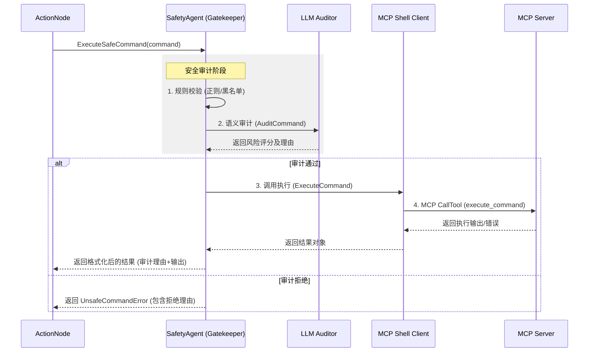

# Safety Agent 集成 LLM 审计与 MCP 执行链路整合实施计划

## 1. 实施背景
目前的 Safety Agent 仅支持基于正则表达式和黑白名单的命令校验。为了提高安全性并确保审计通过后的命令能可靠地通过现有 MCP 架构执行，需要引入 LLM 语义审计，并明确“分析 -> 审计 -> 执行”的完整链路。

## 2. 目标
- 集成 LLM 审计功能到 Safety Agent 的校验流程中。
- 建立从 Safety Agent 到 MCP Client（Shell/K8s）的显式执行链路。
- 确保 Safety Agent 作为执行链路中的“守门员（Gatekeeper）”。
- 提供结构化的审计理由与执行结果反馈。

## 3. 架构设计与执行时序

### 3.1 核心链路描述
系统的执行流程遵循以下时序关系：
1. **分析代理 (Analysis Agent)**：
    - `DecisionNode` 基于当前状态决定需要执行的动作。
    - `CommandGenerator` 生成具体的 Shell 命令。
    - `ActionNode` 获取命令并调用 `SafetyAgent`。
2. **安全代理 (Safety Agent - Gatekeeper)**：
    - **第一层（规则过滤）**：快速拦截已知危险命令（黑名单、正则）。
    - **第二层（LLM 审计）**：对规则通过的命令进行语义意图分析。
    - **决策**：若任一层校验失败，直接返回错误，阻断后续流程。
3. **MCP 客户端执行 (Execution Layer)**：
    - 仅在审计通过后，`SafetyAgent` 内部显式调用关联的 `ShellClient`（即 MCP 客户端）。
    - `ShellClient` 通过 MCP 协议调用远端 `execute_command` 工具。
4. **结果反馈**：
    - 执行结果（成功输出或错误）连同审计结论一同返回给 `ActionNode`。
    - `ActionNode` 更新全局状态 `State`，供下一轮分析使用。

### 3.2 时序图描述 (Mermaid)

## 4. 详细步骤

### 第一阶段：接口与配置扩展
1. **LLM 接口增强**：
   - 在 `internal/agent/analysis/llm.go` 中增加 `AuditCommand(ctx, command) (*AuditResult, error)`。
2. **安全配置更新**：
   - 在 `internal/agent/safety/validator.go` 中增加 `EnableLLMAudit` 和 `AuditRiskThreshold`。
3. **审计结果定义**：
   - 定义 `AuditResult`：包含 `Score` (0-10), `Decision` (ALLOW/DENY), `Reason` (string)。

### 第二阶段：执行链路整合实现
1. **Safety Agent 逻辑改造**：
   - 修改 `internal/agent/safety/agent.go` 中的 `ExecuteSafeCommand`：
     - 显式定义审计逻辑：先 `ValidateCommand` (包含规则+LLM)。
     - 审计通过后，才调用 `a.client.ExecuteCommand`。
2. **MCP 执行对接**：
   - 确认 `internal/client/shell/client.go` 的 `ExecuteCommand` 正确处理 MCP `CallTool` 调用。
   - 确保 `execute_command` 工具的参数（如 `timeout`）能通过 `SafetyAgent` 传递。

### 第三阶段：审计与结果返回完善
1. **Prompt 设计**：
   - LLM 需以 K8s 安全专家身份，分析命令是否包含：非预期的删除、敏感信息提取、特权提升。
2. **结果格式化**：
   - `SafetyAgent` 需整合“审计通过理由”与“MCP 执行输出”，形成完整的反馈字符串。
3. **错误处理**：
   - 区分“审计拒绝”与“执行失败”：
     - 审计拒绝：返回 `UnsafeCommandError`，不计入 MCP 调用。
     - 执行失败：返回 MCP 层的 `ToolExecutionError`，记录在 `state.LastError`。

### 第四阶段：验证
1. **审计闭环测试**：
   - 编写测试用例，模拟 LLM 审计通过并成功触发 MCP Client 调用。
2. **集成测试**：
   - 验证 `ActionNode` -> `SafetyAgent` -> `MCP Shell Client` 的完整通路。

## 5. 预期效果
- 审计逻辑成为执行的必经之路，不存在绕过审计直接执行的可能性。
- 用户能够看到命令为什么被允许执行（审计理由）以及执行的具体结果。
- 架构上清晰分离了分析、安全、执行三个关注点。
