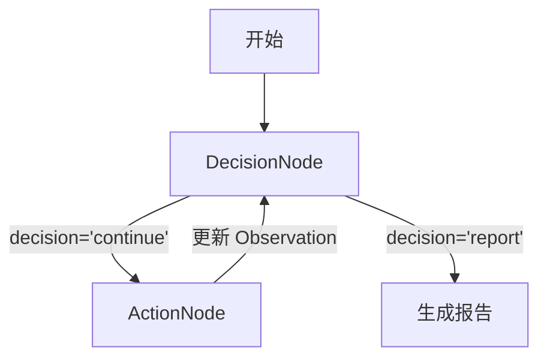

# 计划：优化工具选择与状态管理

## 状态
- **日期**: 2026-02-26
- **作者**: Kilo Code
- **状态**: 提案中 (Proposed)

## 背景
当前的 Kubernetes Analyzer Agent 依赖硬编码的 `CommandGenerator` 进行决策和工具使用，这限制了灵活性。此外，独立调用之间的状态管理相对无状态，可能导致上下文丢失。

本计划概述了以下步骤：
1.  **动态工具选择**：用基于 LLM 的工具选择替换硬编码逻辑。
2.  **混合状态模式**：持久化推理历史以在迭代中保持上下文。

## 1. 混合状态模式 (State Updates)

我们将从无状态模型过渡到混合模型，在此模型中保留推理历史。

### `internal/agent/analysis/state.go` 的变更

1.  **定义 `ReasoningStep` 结构体**：
    ```go
    type ReasoningStep struct {
        Iteration int        `json:"iteration"`
        Timestamp time.Time  `json:"timestamp"`
        Thought   string     `json:"thought"`             // LLM 对此步骤的推理
        Decision  string     `json:"decision"`            // 决策结果 (continue, report)
        ToolCalls []ToolCall `json:"tool_calls,omitempty"`// 如果决策涉及工具调用
        Observation string   `json:"observation,omitempty"` // 执行结果/输出的摘要
    }
    ```

2.  **更新 `State` 结构体**：
    在 `State` 结构体中添加 `ReasoningHistory` 字段。
    ```go
    type State struct {
        // ... 现有字段 ...
        ReasoningHistory []ReasoningStep
    }
    ```

3.  **添加 `AddReasoningStep` 方法**：
    创建一个辅助方法将新步骤追加到历史记录中。

## 2. 动态工具选择 (重构 CommandGenerator)

`CommandGenerator` 目前包含硬编码逻辑（例如，“如果 Pod 状态为 Error，则获取日志”）。我们将把这个逻辑移到 LLM 的提示词和工具选择能力中。

### 2.1 CommandGenerator 分析：弃用 vs 重构

在引入动态工具选择时，我们需要决定如何处理现有的 `CommandGenerator`。

#### 选项 A: 重构 (Refactor)
保留 `CommandGenerator` 接口，但在其内部调用 LLM。
*   **优点**: 保持现有接口签名不变，对调用者的改动最小。
*   **缺点**: 增加了不必要的抽象层；`CommandGenerator` 的命名暗示了指令式生成，而我们正转向声明式推理；不符合 ReAct 模式的最佳实践。

#### 选项 B: 弃用 (Deprecate)
完全移除 `CommandGenerator`，将推理和决策逻辑直接集成到 `ReActLLM` 中。
*   **优点**: 简化架构，减少中间层；将推理逻辑集中在 `ReActLLM` 中，更符合 Agent 的设计模式；消除硬编码规则的遗留负担。
*   **缺点**: 需要修改调用处的代码。

#### 推荐方案：弃用 (Deprecate)
鉴于 `CommandGenerator` 的初衷是为了封装硬编码规则，而我们现在的目标是基于 LLM 的动态推理，**推荐选择选项 B**。我们将把决策逻辑迁移到 `ReActLLM` 中，使其成为真正的推理引擎。

**关于 Child Agents 的说明：**
虽然我们的架构设计支持 Child Agents（子智能体），但在当前的优化阶段，重点是让 `ReActLLM` 直接调用 K8s MCP 工具（如 `list_pods`, `get_pod_logs`）来收集数据。这减少了调用链路的复杂性，并允许主 Agent 更直接地控制调查过程。未来如果任务变得极其复杂，可以考虑将特定领域的分析任务（如深入的日志分析）委托给专门的 Child Agent。

### 2.2 LLM 响应的 JSON Schema

为了确保解析的可靠性，LLM 的响应必须遵循以下 JSON Schema。
**注意**：`tool_calls` 中的工具必须是 `internal/client/k8s` 中定义的实际 **K8s MCP Tools** (例如 `list_pods`, `get_pod_logs`, `list_events`)。
**关键约束**：`tool_calls` 必须严格匹配 MCP `CallTool` 的签名要求：`name` (string) 和 `args` (map[string]interface{})。

```json
{
  "$schema": "http://json-schema.org/draft-07/schema#",
  "type": "object",
  "properties": {
    "thought": {
      "type": "string",
      "description": "分析当前情况、历史记录并决定下一步行动的推理过程。"
    },
    "decision": {
      "type": "string",
      "enum": ["continue", "report"],
      "description": "决策结果：'continue' 表示需要更多信息或工具调用，'report' 表示分析完成，可以生成报告。"
    },
    "tool_calls": {
      "type": "array",
      "items": {
        "type": "object",
        "properties": {
          "name": {
            "type": "string",
            "description": "要调用的工具名称。包括 K8s MCP 工具 (如 'list_pods', 'get_pod_logs') 和安全 Shell 工具 ('execute_safe_command')。"
          },
          "arguments": {
            "type": "object",
            "description": "传递给工具的参数键值对。例如: { 'namespace': 'default' } 或 { 'command': 'curl -I http://x.x.x.x', 'reason': 'check connectivity' }。"
          }
        },
        "required": ["name", "arguments"]
      },
      "description": "如果 decision 是 'continue'，则列出需要执行的工具调用。"
    }
  },
  "required": ["thought", "decision"]
}
```

### 2.3 Integration with Safety Agent (Safety Agent 集成)

在动态工具选择流程中，`Safety Agent` 将作为一种特殊的工具 `execute_safe_command` 暴露给 LLM。

1.  **工具暴露**: `SafetyAgent` 已经被 `WrapSafetyAgent` 包装为 `tool.BaseTool` (在 `internal/agent/analysis/tools.go` 中)。我们需要确保这个工具被包含在传递给 `ReActLLM` 的工具列表中。
2.  **LLM 感知**: 在系统提示词中，明确告知 LLM 如果需要执行非 K8s API 的操作（如网络探测 `curl`、文本处理 `grep` 等），可以使用 `execute_safe_command` 工具。
3.  **ActionNode 逻辑**: `ActionNode` 需要能够区分 K8s 工具和 Shell 工具。
    *   虽然 `SafetyAgentToolAdapter` 已经封装了执行逻辑，但在 `ActionNode` 中我们可以统一处理：
        *   如果是 K8s 工具 -> `k8sClient.CallTool`
        *   如果是 `execute_safe_command` -> 调用 `SafetyAgentToolAdapter` (或者直接调用 `safetyAgent.ExecuteSafeCommandWithAudit`)
    *   **推荐方案**: 为了统一，尽量让所有工具都通过统一的接口调用。但鉴于 `Safety Agent` 的特殊性（审计、安全检查），在 `ActionNode` 中保留明确的分支逻辑可能更安全、更易调试。

### `internal/agent/analysis/llm.go` 的变更

1.  **移除 `CommandGenerator`**：
    删除 `CommandGenerator` 接口及其实现。

2.  **更新 `LLM` 接口**：
    确保 `MakeDecision` 返回 `(*DecisionResult, error)`，其中 `DecisionResult` 包含：
    ```go
    type DecisionResult struct {
        Decision  Decision   // DecisionContinue 或 DecisionReport
        Reasoning string     // LLM 的思考过程
        ToolCalls []ToolCall // 具体的工具调用列表
    }
    ```

## 3. 图执行数据流与状态逻辑

我们将通过 LangGraph（或类似的图结构）来管理执行流。主要节点包括 `DecisionNode`（决策节点）和 `ActionNode`（执行节点）。

### 数据流图示



### 状态填充逻辑 (State Logic)

`ReasoningStep` 字段在图执行的不同阶段被填充：

1.  **在 `DecisionNode` 中 (决策阶段)**:
    *   **输入**: 当前 `State` (包含之前的 `ReasoningHistory`)。
    *   **动作**: 调用 LLM `MakeDecision`。
    *   **状态更新**: 创建一个新的 `ReasoningStep`。
        *   `Iteration`: 当前迭代计数。
        *   `Timestamp`: 当前时间。
        *   `Thought`: 来自 LLM 响应的 `thought` 字段。
        *   `Decision`: 来自 LLM 响应的 `decision` 字段。
        *   `ToolCalls`: 来自 LLM 响应的 `tool_calls` 字段。
        *   `Observation`: **此时为空**。
    *   **输出**: 将此新步骤追加到 `State.ReasoningHistory`。如果决策是 `report`，则流程结束；如果是 `continue`，流向 `ActionNode`。

2.  **在 `ActionNode` 中 (执行阶段)**:
    *   **输入**: 当前 `State` (读取 `ReasoningHistory` 中最新的一个步骤，即刚刚在 `DecisionNode` 创建的步骤)。
    *   **动作**: 遍历并执行该步骤中的 `ToolCalls`（根据工具名称/类型分发给 K8sClient 或 SafetyAgent）。
    *   **状态更新**:
        *   收集所有工具调用的输出结果。
        *   将结果合并为一个字符串（或结构化数据）。
        *   更新最新 `ReasoningStep` 的 `Observation` 字段。
    *   **输出**: 更新后的 `State` 返回给 `DecisionNode` 进行下一轮分析。

## 4. 实现步骤

### 步骤 1: 更新状态定义
- [ ] 修改 `internal/agent/analysis/state.go`，添加 `ReasoningStep` 结构体和 `ReasoningHistory` 字段。
- [ ] 在 `State` 中添加 `AddReasoningStep` 和 `UpdateLastStepObservation` 方法。

### 步骤 2: 重构 LLM 接口和 Mock
- [ ] 修改 `internal/agent/analysis/llm.go`:
    - 定义 `DecisionResult` 结构体。
    - 更新 `LLM` 接口 `MakeDecision` 返回 `(*DecisionResult, error)`。
- [ ] 更新 `internal/agent/analysis/llm.go` 中的 `MockLLM` 以匹配新接口。

### 步骤 3: 在 ReActLLM 中实现动态工具选择
- [ ] 修改 `internal/agent/analysis/react_llm.go`:
    - 更新 `buildDecisionPrompt` 以包含 `ReasoningHistory`。
    - 更新 `MakeDecision` 以调用 LLM 并将响应解析为 `DecisionResult`（使用上述 JSON Schema）。
    - 确保系统提示词鼓励 LLM 输出其推理（Thought）和工具调用。

### 步骤 4: 移除硬编码的 CommandGenerator 逻辑
- [ ] 修改 `internal/agent/analysis/llm.go` 或相关文件:
    - 移除 `CommandGenerator.GenerateCommand` 中的硬编码规则。
    - 彻底移除 `CommandGenerator`，直接使用 LLM 进行决策。

### 步骤 5: 更新编排 (Graph)
- [ ] 修改 `internal/agent/analysis/graph.go`:
    - **DecisionNode**:
        1. 调用 `MakeDecision`。
        2. 使用 LLM 的 `thought`, `decision`, `tool_calls` 更新 `state.ReasoningHistory`。
    - **ActionNode** (新建或修改 ProcessingNode):
        1. 获取最后一个 `ReasoningStep`。
        2. 遍历并执行 `ToolCalls`，使用以下显式分发逻辑 (Explicit Dispatch Logic)：
            ```go
            for _, toolCall := range step.ToolCalls {
                var output string
                var err error
                
                switch toolCall.Name {
                case "execute_safe_command":
                    // 路由到 SafetyAgent
                    // 注意：SafetyAgent 是一个独立的、由 LLM 驱动的子智能体 (Sub-Agent)。
                    // 调用此工具不仅仅是执行命令，而是启动一个包含安全审计、风险评估和执行的完整工作流。
                    // 它有自己的提示词和上下文来判断命令是否安全。
                    output, err = safetyAgent.ExecuteSafeCommand(ctx, toolCall.Arguments["command"])
                    
                default:
                    // 默认路由到 K8sClient (MCP)
                    // 包括: list_pods, get_pod_logs, describe_pod, list_events 等
                    output, err = k8sClient.CallTool(ctx, toolCall.Name, toolCall.Arguments)
                }
                
                // ... 聚合 output 到 observation ...
            }
            ```
        3. 使用执行结果更新 `state.ReasoningHistory` 中的 `Observation`。

## 5. 提示词结构变更

**系统提示词 (System Prompt):**
应更新为指示 LLM 作为一个有状态的智能体行事。
“你是一个 Kubernetes 诊断代理。你将收到当前状态和你之前的行动历史。根据此历史记录做出下一个决定，以避免循环和冗余检查。”

**决策提示词 (Decision Prompt):**
```text
## 上下文
用户查询: {{.UserInput}}

## 推理历史 (Reasoning History)
{{range .ReasoningHistory}}
步骤 {{.Iteration}}:
思考: {{.Thought}}
决策: {{.Decision}}
工具调用: {{range .ToolCalls}}{{.Name}} {{end}}
观察结果: {{.Observation}}
{{end}}

## 当前资源
Pods: {{len .K8sInfo.Pods}}
...

## 任务
决定下一步。返回一个 JSON 对象，必须严格遵守以下 Schema:
{
  "thought": "分析当前情况...",
  "decision": "continue" | "report",
  "tool_calls": [ { "name": "...", "arguments": { ... } } ]
}
```

## 6. 验证计划
- **单元测试**: 更新 `state_test.go` 和 `react_llm_test.go` 以验证状态更新和历史持久化。
- **集成测试**: 运行模拟分析流程，确保推理历史增长且 LLM 正确引用它。
