# K8s 诊断 Agent V2 实施计划

> 基于 [architecture-v2.md](architecture-v2.md) 的分阶段实施方案。每个阶段可独立交付和验证。

---

## 阶段总览

```mermaid
gantt
    title 实施阶段
    dateFormat X
    axisFormat %s

    section P0 基础设施
    日志 + 配置             :p0a, 0, 2
    Gateway Client          :p0b, 0, 3
    Shell MCP Client        :p0c, 0, 3

    section P1 Safety Agent
    规则引擎                :p1a, 3, 5
    LLM 审计器              :p1b, 5, 7
    Safety Agent 集成       :p1c, 7, 8

    section P2 Main Agent
    State + 类型定义         :p2a, 3, 4
    InfoNode                :p2b, 5, 7
    DecisionNode            :p2c, 7, 9
    ActionNode              :p2d, 9, 11
    CompressNode            :p2e, 11, 12
    ReportNode              :p2f, 12, 14

    section P3 LLM 层
    LLM Router              :p3a, 5, 7
    Prompts                 :p3b, 7, 9
    ReAct LLM               :p3c, 9, 12
    输出解析                 :p3d, 9, 11

    section P4 集成
    Graph 编排               :p4a, 14, 16
    程序入口                 :p4b, 16, 17
    端到端测试               :p4c, 17, 19

    section P5 增强
    FindingStore             :p5a, 14, 16
    OutputSummarizer         :p5b, 14, 15
```



| 阶段 | 内容 | 预估工时 | 交付物 |
|------|------|---------|-------|
| **P0** | 基础设施层 | 3 天 | logger, config, gateway client, mcp client |
| **P1** | Safety Agent | 3 天 | 规则引擎, LLM 审计, agent 集成 |
| **P2** | Main Agent 节点 | 6 天 | 5 个 Graph 节点 |
| **P3** | LLM 层 | 4 天 | Router, Prompts, ReAct, Parser |
| **P4** | 端到端集成 | 3 天 | Graph 编排, main.go, E2E 测试 |
| **P5** | 增强功能 | 2 天 | FindingStore, OutputSummarizer |
| **总计** | — | **~21 天** | — |

---

## P0：基础设施层（3天）

### P0.1 日志模块

**文件**：`internal/logger/logger.go`

```go
// 功能要求
- 基于 zap 的结构化日志
- 支持 Debug/Info/Warn/Error/Fatal 级别
- 日志轮转（lumberjack）
- 便捷字段方法：String(), Int(), Err(), Any()

// 配置
type LogConfig struct {
    Level      string // debug/info/warn/error
    FilePath   string // 日志文件路径
    MaxSizeMB  int    // 单文件最大大小
    MaxBackups int    // 最大备份数
}
```

**验证**：单元测试，确认日志输出格式和轮转行为。

---

### P0.2 配置模块

**文件**：`internal/config/config.go`

```go
// 全局配置结构
type Config struct {
    Gateway  GatewayConfig  `yaml:"gateway"`
    ShellMCP ShellMCPConfig `yaml:"shell_mcp"`
    LLM      AgentLLMConfig `yaml:"llm"`
    Store    StoreConfig    `yaml:"store"`
    Agent    AgentConfig    `yaml:"agent"`
    Log      LogConfig      `yaml:"log"`
}

type GatewayConfig struct {
    BaseURL        string `yaml:"base_url"`
    AuthToken      string `yaml:"auth_token"`      // 支持 ${ENV_VAR}
    TimeoutSeconds int    `yaml:"timeout_seconds"`
}

type ShellMCPConfig struct {
    ServerURL string `yaml:"server_url"`
    Transport string `yaml:"transport"`  // "sse"
    AuthToken string `yaml:"auth_token"`
}

type AgentLLMConfig struct {
    Light LLMConfig `yaml:"light"`
    Power LLMConfig `yaml:"power"`
}

type AgentConfig struct {
    MaxIterations   int `yaml:"max_iterations"`    // 默认 10
    CompressThreshold int `yaml:"compress_threshold"` // 默认 4
    OutputMaxLines  int `yaml:"output_max_lines"`  // 默认 50
    OutputMaxChars  int `yaml:"output_max_chars"`  // 默认 3000
    FindingTTLHours int `yaml:"finding_ttl_hours"` // 默认 1
}
```

**核心功能**：
- 从 `configs/config.yaml` 加载
- 环境变量替换（`${VAR_NAME}` 语法）
- 配置校验（必填字段检查）

**验证**：单元测试 + 示例 `configs/config.yaml`。

---

### P0.3 Gateway Client

**文件**：
- `internal/client/gateway/types.go` — 请求/响应结构体
- `internal/client/gateway/client.go` — HTTP REST 客户端

```go
// types.go — 与 agent-kubectl-gateway API 对齐
type KubectlRequest struct {
    Verb      string          `json:"verb"`
    Resource  string          `json:"resource"`
    Namespace string          `json:"namespace"`
    Name      string          `json:"name,omitempty"`
    Options   *KubectlOptions `json:"options,omitempty"`
    Output    string          `json:"output,omitempty"`
    Mode      string          `json:"mode"` // 固定 "structured"
}

type KubectlOptions struct {
    LabelSelector string `json:"labelSelector,omitempty"`
    FieldSelector string `json:"fieldSelector,omitempty"`
    Limit         int    `json:"limit,omitempty"`
    Container     string `json:"container,omitempty"`
    TailLines     int    `json:"tailLines,omitempty"`
    Since         string `json:"since,omitempty"`
    AllNamespaces bool   `json:"allNamespaces,omitempty"`
    Output        string `json:"output,omitempty"`
}

type KubectlResponse struct {
    RequestID         string `json:"request_id"`
    Status            string `json:"status"`    // success / error
    ExitCode          int    `json:"exit_code"`
    Stdout            string `json:"stdout"`
    Stderr            string `json:"stderr"`
    Truncated         bool   `json:"truncated"`
    DurationMs        int    `json:"duration_ms"`
    ResponseSizeBytes int    `json:"response_size_bytes"`
    BlockedReason     string `json:"blocked_reason"`
}

// client.go
type GatewayClient struct { ... }

func NewGatewayClient(cfg *config.GatewayConfig) (*GatewayClient, error)
func (c *GatewayClient) Execute(ctx context.Context, req *KubectlRequest) (*KubectlResponse, error)

// 便捷方法
func (c *GatewayClient) ListPods(ctx, ns, labelSelector) (*KubectlResponse, error)
func (c *GatewayClient) DescribePod(ctx, ns, name) (*KubectlResponse, error)
func (c *GatewayClient) GetLogs(ctx, ns, pod, container, tailLines) (*KubectlResponse, error)
func (c *GatewayClient) ListEvents(ctx, ns) (*KubectlResponse, error)
func (c *GatewayClient) ListDeployments(ctx, ns) (*KubectlResponse, error)
func (c *GatewayClient) ListNamespaces(ctx) (*KubectlResponse, error)
func (c *GatewayClient) GetNodes(ctx) (*KubectlResponse, error)
```

**实现要点**：
- HTTP POST `{base_url}/execute`，Content-Type: `application/json`
- Auth Header: `Authorization: Bearer {token}`
- 超时控制：使用 `context.WithTimeout`
- 错误处理：检查 `response.Status` 和 `response.BlockedReason`

**验证**：
- Mock HTTP Server 单元测试
- 连接真实 Gateway 的集成测试（可选）

---

### P0.4 Shell MCP Client

**文件**：
- `internal/client/shellmcp/types.go`
- `internal/client/shellmcp/client.go`

```go
// types.go
type ExecuteResult struct {
    Results []NodeResult
}

type NodeResult struct {
    NodeID   string
    Stdout   string
    Stderr   string
    ExitCode int
    Success  bool
}

// client.go
type ShellMCPClient struct { ... }

func NewShellMCPClient(cfg *config.ShellMCPConfig) (*ShellMCPClient, error)
func (c *ShellMCPClient) Connect(ctx context.Context) error
func (c *ShellMCPClient) Close() error
func (c *ShellMCPClient) ExecuteCommand(ctx context.Context, command string) (*ExecuteResult, error)
func (c *ShellMCPClient) ListTools(ctx context.Context) ([]ToolInfo, error)
```

**实现要点**：
- 基于 `github.com/modelcontextprotocol/go-sdk` 实现 MCP Client
- SSE Transport 连接
- 调用 `execute_command` 工具
- 解析聚合的多节点结果

**验证**：Mock MCP Server 单元测试。

---

## P1：Safety Agent（3天）

### P1.1 规则引擎

**文件**：`internal/agent/safety/rules.go`

```go
type RuleEngine struct {
    whitelist []string         // 白名单命令前缀
    blacklist []*regexp.Regexp // 黑名单正则模式
}

func NewRuleEngine(configPath string) (*RuleEngine, error)
func (r *RuleEngine) Evaluate(command string) RuleResult

type RuleResult struct {
    Action string // "allow" / "deny" / "unknown"（需 LLM 审计）
    Reason string
}
```

**配置文件**：`configs/safety_rules.yaml`（白名单 + 黑名单，见 architecture-v2.md 5.3 节）

**实现要点**：
- 命令标准化：trim、collapse spaces、lowercase 首个 token
- 白名单：前缀匹配（`df` 匹配 `df -h`、`df /tmp`）
- 黑名单：正则匹配（`rm\s+-rf` 等）
- 优先级：白名单 > 黑名单 > unknown

**验证**：表驱动测试，覆盖白名单命中、黑名单命中、unknown 三种情况。用例至少 20 个。

---

### P1.2 LLM 审计器

**文件**：`internal/agent/safety/llm_auditor.go`

```go
type LLMAuditor struct {
    llm LLMClient // 使用 Light 模型
}

func NewLLMAuditor(llm LLMClient) *LLMAuditor

type AuditResult struct {
    SafetyLevel string // safe / warning / dangerous
    Reason      string
    Advice      string // 替代命令建议
}

func (a *LLMAuditor) Audit(ctx context.Context, command, reason string) (*AuditResult, error)
```

**Prompt**：见 architecture-v2.md 5.4 节。

**实现要点**：
- 调用 Light LLM，要求 JSON 输出
- JSON 解析失败时重试 1 次（附带解析错误信息）
- 超时降级：`context.DeadlineExceeded` → 返回 `nil`（由 Agent 层降级到规则判断）

**验证**：Mock LLM 单元测试。

---

### P1.3 Safety Agent 集成

**文件**：`internal/agent/safety/agent.go`

```go
type SafetyAgent struct {
    rules     *RuleEngine
    auditor   *LLMAuditor   // 可选
    mcpClient *ShellMCPClient
}

func NewSafetyAgent(rules *RuleEngine, auditor *LLMAuditor, mcpClient *ShellMCPClient) *SafetyAgent

// 核心方法 — 审计 + 执行
func (a *SafetyAgent) ExecuteSafeCommand(ctx context.Context, req *CommandRequest) (*CommandResult, error) {
    // 1. 规则引擎评估
    // 2. 如果 unknown → LLM 审计（如果可用）
    // 3. 如果 allow → 调用 MCP 执行
    // 4. 如果 deny → 返回拒绝结果（含 Advice）
    // 5. 格式化 CommandResult 返回
}
```

**关键行为**：
- 拒绝时 `CommandResult.AuditInfo.Allowed = false`，**不返回 error**（error 仅用于系统级故障）
- 拒绝结果包含 `Advice`（替代命令建议，来自 LLM 审计或预设建议）
- LLM 审计不可用时（nil 或超时），降级到规则判断：unknown → 默认拒绝，日志 Warn

**验证**：
- 白名单命令 → 跳过 LLM → 执行成功
- 黑名单命令 → 立即拒绝，不调 LLM
- unknown 命令 → LLM 审计 → 通过/拒绝
- LLM 超时 → 降级拒绝

---

## P2：Main Agent 节点（6天）

### P2.1 State + 类型定义

**文件**：
- `internal/state/types.go` — K8sInfo, Finding, Recommendation, ToolCall 等
- `internal/state/state.go` — State 定义 + 辅助方法

```go
// types.go
type K8sInfo struct {
    Namespaces []string
    Resources  map[string][]any  // "Pods" → []PodInfo, etc.
}

type PodInfo struct {
    Name, Namespace, Status, NodeName string
    Restarts int32
    Labels   map[string]string
}

type Finding struct {
    Severity, Resource, Message string
    Timestamp time.Time
    Verified  bool // 是否经工具验证
}

type ToolCall struct {
    Tool string
    Args map[string]interface{}
}

type ReasoningStep struct {
    Iteration   int
    Timestamp   time.Time
    Thought     string
    Decision    string
    ToolCalls   []ToolCall
    Observation string
    Duration    time.Duration
    TokensUsed  int
}

// state.go
type State struct {
    UserInput         string
    K8sInfo           *K8sInfo
    ReasoningHistory  []ReasoningStep
    CompressedSummary string
    CompressThreshold int // 默认 4
    IterationCount    int
    MaxIterations     int // 默认 10
    AnalysisResult    *AnalysisResult
    LastError         error
    LastAction        string
}

func NewState(userInput string, cfg *config.AgentConfig) *State
func (s *State) AddReasoningStep(...)
func (s *State) AddFinding(...)
func (s *State) AddCommandExecution(...)
func (s *State) ShouldContinue() bool
```

**验证**：单元测试各辅助方法。

---

### P2.2 InfoNode

**文件**：`internal/agent/diagnosis/info_node.go`

```go
type InfoNode struct {
    gateway *GatewayClient
}

func (n *InfoNode) Execute(ctx context.Context, state *State) (*State, error) {
    // 1. ListNamespaces → 获取命名空间列表
    // 2. 检查用户输入是否指定了命名空间
    // 3. 遍历命名空间，收集 Pods + Deployments
    // 4. 解析 Gateway JSON 响应 → PodInfo/DeploymentInfo
    // 5. 更新 state.K8sInfo
}
```

**实现要点**：
- Gateway 返回的是 kubectl stdout（JSON/table 格式），需要解析
- 推荐请求 `output: "json"` 格式，便于结构化解析
- 命名空间提取：从用户输入中匹配 "namespace:" / "命名空间" 等关键词

**验证**：Mock GatewayClient 单元测试。

---

### P2.3 DecisionNode

**文件**：`internal/agent/diagnosis/decision_node.go`

```go
type DecisionNode struct {
    llm LLMRouter // 使用 Light 模型
}

type DecisionResult struct {
    Decision       string     // continue / deep_query / report
    Reasoning      string     // Thought（含轻量规划）
    ToolCalls      []ToolCall // decision=continue 时填写
    DeepQueryTopic string     // decision=deep_query 时填写（描述需要深入调查的问题）
}

func (n *DecisionNode) Execute(ctx context.Context, state *State) (*DecisionResult, error) {
    // 1. 检查 MaxIterations（达到上限 → 强制 report）
    // 2. 构建 Prompt（含压缩历史 + 规划引导）
    // 3. 调用 Light LLM
    // 4. 解析 JSON 响应（含 decision + tool_calls + deep_query_topic）
    // 5. 添加到 ReasoningHistory
    // 6. 返回 DecisionResult
}

func (n *DecisionNode) fallbackDecision(state *State) *DecisionResult
```

**三种决策的行为**：

| 决策 | 场景 | ActionNode 行为 |
|------|------|----------------|
| `continue` | 明确知道要调哪些工具 | 按 `tool_calls` 列表逐一执行 |
| `deep_query` | 需要多步关联调查，无法预先确定步骤 | 将 `deep_query_topic` 委托给 ReAct LLM 自主调查 |
| `report` | 信息充足或达到 MaxIterations | 跳过 ActionNode，直接 ReportNode |

**依赖**：`internal/llm/prompts.go` 中的 `BuildDecisionPrompt()`。

---

### P2.4 ActionNode

**文件**：`internal/agent/diagnosis/action_node.go`

```go
type ActionNode struct {
    gateway     *GatewayClient
    safetyAgent *SafetyAgent
    reactLLM    *ReActLLM     // 用于 deep_query 模式
}

func (n *ActionNode) Execute(ctx context.Context, state *State) (*State, error) {
    lastStep := state.ReasoningHistory[len(state.ReasoningHistory)-1]

    switch lastStep.Decision {
    case "continue":
        // continue 模式：按 tool_calls 逐一执行
        return n.executeContinue(ctx, state, lastStep.ToolCalls)
    case "deep_query":
        // deep_query 模式：委托 ReAct LLM 自主调查
        return n.executeDeepQuery(ctx, state, lastStep.DeepQueryTopic)
    default:
        return state, fmt.Errorf("unexpected decision: %s", lastStep.Decision)
    }
}

func (n *ActionNode) executeContinue(ctx context.Context, state *State, toolCalls []ToolCall) (*State, error) {
    // 1. 遍历 ToolCalls：
    //    - "execute_safe_command" → SafetyAgent.ExecuteSafeCommand()
    //    - 其他 K8s 工具 → 转换为 KubectlRequest → Gateway.Execute()
    // 2. 收集所有 Observation
    // 3. 处理 Safety Agent 拒绝结果（记录为 Observation，含替代建议）
}

func (n *ActionNode) executeDeepQuery(ctx context.Context, state *State, topic string) (*State, error) {
    // 1. 构建 ErrorContext（包含 topic + 当前 K8s 信息）
    // 2. 调用 reactLLM.DeepAnalyze(ctx, errorCtx)
    //    ReAct LLM 会自主多步调用工具（Gateway + SafetyAgent）
    // 3. 将 ReAct 的分析结果作为 Observation 写入 state
}
```

**两种模式对比**：

| | continue 模式 | deep_query 模式 |
|---|---|---|
| 控制权 | DecisionNode 指定工具 | ReAct LLM 自主决定 |
| 工具调用数 | 1-3 个（明确指定） | 不限（ReAct 自主控制，MaxStep=10） |
| LLM 模型 | 不调用 LLM | Power 模型 |
| 适用场景 | “查看日志”“查看 Events” | “网络是否有问题”“DNS 解析链路排查” |
| Token 成本 | 低 | 高（多轮 Power LLM 调用） |

**工具名 → Gateway 请求映射表**（continue 模式）：

| ToolCall.Tool | KubectlRequest.Verb | KubectlRequest.Resource |
|---------------|--------------------|-----------------------|
| `list_pods` | `get` | `pods` |
| `describe_pod` | `describe` | `pod` |
| `get_pod_logs` | `logs` | `pod` |
| `list_events` | `get` | `events` |
| `list_deployments` | `get` | `deployments` |
| `list_services` | `get` | `services` |
| `get_nodes` | `get` | `nodes` |
| `list_namespaces` | `get` | `namespaces` |
| `execute_safe_command` | — | → SafetyAgent |

---

### P2.5 CompressNode

**文件**：`internal/agent/diagnosis/compress_node.go`

```go
type CompressNode struct {
    threshold  int // 默认 4
    recentKeep int // 默认 3
}

func (n *CompressNode) Execute(ctx context.Context, state *State) (*State, error) {
    // 条件触发：len(ReasoningHistory) <= threshold → 直接返回
    // 规则化压缩早期步骤 → state.CompressedSummary
    // 保留最近 recentKeep 轮完整
}
```

**验证**：测试 3/5/8/10 轮历史时的压缩行为。

---

### P2.6 ReportNode

**文件**：`internal/agent/diagnosis/report_node.go`

```go
type ReportNode struct {
    llm   LLMRouter // 使用 Power 模型
    store FindingStore
}

func (n *ReportNode) Execute(ctx context.Context, state *State) (*AnalysisResult, error) {
    // 1. 过滤执行命令（去除噪声命令）
    // 2. 调用 Power LLM 生成综合报告（SynthesizeReport Prompt）
    // 3. 分析 Findings（异常 Pod 去重）
    // 4. 生成 Recommendations
    // 5. 设置状态 completed / partial
}
```

**依赖**：`internal/llm/prompts.go` 中的 `BuildSynthesizePrompt()`。

---

## P3：LLM 层（4天）

### P3.1 LLM Router

**文件**：`internal/llm/router.go`

```go
type LLMRouter struct {
    light *ChatModel
    power *ChatModel
}

func NewLLMRouter(cfg *config.AgentLLMConfig) (*LLMRouter, error)
func (r *LLMRouter) Light() *ChatModel
func (r *LLMRouter) Power() *ChatModel

type ChatModel struct { ... }
func (m *ChatModel) Generate(ctx context.Context, messages []*schema.Message) (*schema.Message, error)
```

**实现要点**：
- 基于 `cloudwego/eino-ext/components/model/openai` 创建 ChatModel
- 支持 OpenAI 兼容的 API（OpenAI / DeepSeek / Gemini 等）

---

### P3.2 Prompts

**文件**：`internal/llm/prompts.go`

集中管理所有 Prompt 模板。每个 Prompt 遵循以下原则：

- **角色明确**：开头明确身份和职责边界
- **输出约束**：严格 JSON Schema，降低解析失败率
- **语言统一**：所有输出使用中文
- **Token 控制**：仅注入必要上下文，避免冗余

---

#### 3.2.1 DecisionPrompt — 决策 + 轻量规划

**调用方**：`DecisionNode`（Light 模型）

**输入变量**：

| 变量 | 来源 | 说明 |
|------|------|------|
| `{user_query}` | `state.UserInput` | 用户原始查询 |
| `{compressed_summary}` | `state.CompressedSummary` | 早期步骤压缩摘要（可为空） |
| `{recent_steps}` | `state.ReasoningHistory` | 最近 3 轮完整推理记录 |
| `{resource_summary}` | `state.K8sInfo.GetSummary()` | K8s 资源概况 |
| `{abnormal_pods}` | 从 K8sInfo 提取 | 异常 Pod 列表 |
| `{iteration}` | `state.IterationCount` | 当前迭代轮次 |
| `{max_iterations}` | `state.MaxIterations` | 最大迭代数 |

**完整 Prompt 模板**：

```
你是一个 Kubernetes 集群诊断专家。你的任务是分析集群状态，决定下一步诊断行动。

## 用户查询
{user_query}

## 当前集群状态
{resource_summary}

### 异常资源
{abnormal_pods}

{compressed_summary_block}

## 最近推理步骤
{recent_steps}

## 当前进度
第 {iteration}/{max_iterations} 轮迭代。

## 可用工具
- list_pods: 列出 Pod 列表。参数: namespace, labelSelector
- describe_pod: 查看 Pod 详情。参数: namespace, name
- get_pod_logs: 获取 Pod 日志。参数: namespace, name, container, tailLines
- list_events: 列出 Events。参数: namespace
- list_deployments: 列出 Deployments。参数: namespace
- list_services: 列出 Services。参数: namespace
- get_nodes: 查看节点状态。无参数
- execute_safe_command: 在集群节点上执行 Shell 命令（需通过安全审计）。参数: command, reason

## Thought 格式要求
你的 thought 必须包含以下三部分：
1. **当前认知**：基于已有信息，目前了解到什么？有哪些异常？
2. **初步计划**：接下来打算按什么顺序调查？（列出 2-3 步）
3. **本轮行动**：这一轮具体执行计划中的哪一步？为什么？

注意：计划是动态的，每轮根据新发现调整。如果之前有命令被安全审计拒绝，请参考拒绝建议调整命令。

## 输出格式（严格 JSON，不要包含其他内容）
{
  "thought": "你的完整推理过程（含当前认知、初步计划、本轮行动）",
  "decision": "continue 或 deep_query 或 report",
  "tool_calls": [
    {
      "name": "工具名",
      "args": { "参数名": "参数值" }
    }
  ],
  "deep_query_topic": "仅当 decision=deep_query 时填写，描述需要深入调查的问题"
}

决策规则：
- 如果信息不足，且知道要调哪些工具 → decision = "continue"，填写 tool_calls
- 如果需要多步关联调查，无法预先确定步骤 → decision = "deep_query"，填写 deep_query_topic
- 如果已收集到足够信息可以给出诊断 → decision = "report"，tool_calls 为空
- 如果已达到第 {max_iterations} 轮 → 必须 decision = "report"
- decision=continue 时 tool_calls 每轮最多 3 个
- decision=deep_query 适用于复杂场景（如网络链路排查、DNS 问题、跨节点调查）
```

**`{compressed_summary_block}` 条件渲染**：

```go
func buildCompressedBlock(summary string) string {
    if summary == "" {
        return ""
    }
    return fmt.Sprintf("## 早期调查摘要\n%s\n", summary)
}
```

---

#### 3.2.2 SynthesizePrompt — 报告生成

**调用方**：`ReportNode`（Power 模型）

**输入变量**：

| 变量 | 来源 | 说明 |
|------|------|------|
| `{user_query}` | `state.UserInput` | 用户原始查询 |
| `{findings}` | 从 ReasoningHistory 提取 | 关键发现列表 |
| `{command_summary}` | 从 ReasoningHistory 提取 | 执行过的命令及结果摘要 |
| `{k8s_summary}` | `state.K8sInfo.GetSummary()` | K8s 资源概况 |
| `{blocked_commands}` | 从 ReasoningHistory 提取 | 被安全审计拒绝的命令列表 |
| `{status}` | 由迭代是否耗尽决定 | "completed" / "partial" |

**完整 Prompt 模板**：

```
你是一个 Kubernetes 集群诊断报告撰写专家。请根据以下诊断数据生成一份结构化的中文诊断报告。

## 用户查询
{user_query}

## 诊断状态
{status}

## 集群资源概况
{k8s_summary}

## 关键发现
{findings}

## 已执行的诊断命令
{command_summary}

{blocked_commands_block}

## 报告输出格式（严格 JSON）
{
  "summary": "一句话总结诊断结论",
  "severity": "critical / warning / info",
  "root_cause": "根因分析（如能确定）",
  "findings": [
    {
      "resource": "受影响的资源名",
      "severity": "critical / warning / info",
      "message": "具体发现描述",
      "evidence": "支持该发现的证据（日志片段、指标等）"
    }
  ],
  "recommendations": [
    {
      "priority": "high / medium / low",
      "action": "建议的修复操作",
      "command": "具体的修复命令（如有）",
      "risk": "操作风险说明"
    }
  ],
  "limitations": "诊断过程中的限制说明（如有命令被安全拒绝）"
}

报告规则：
- 所有内容使用中文
- findings 按 severity 从高到低排序
- recommendations 按 priority 从高到低排序
- 如果诊断状态为 partial，在 limitations 中说明未完成的原因
- 如果有命令被安全审计拒绝，在 limitations 中说明，并建议运维人员手动执行
- evidence 字段应引用具体的日志行或指标数值，不要泛泛而谈
```

**`{blocked_commands_block}` 条件渲染**：

```go
func buildBlockedCommandsBlock(blocked []BlockedCommand) string {
    if len(blocked) == 0 {
        return ""
    }
    var sb strings.Builder
    sb.WriteString("## 被安全审计拒绝的命令\n")
    for _, cmd := range blocked {
        sb.WriteString(fmt.Sprintf("- `%s` — 原因: %s\n", cmd.Command, cmd.Reason))
    }
    return sb.String()
}
```

---

#### 3.2.3 SafetyAuditPrompt — 命令安全审计

**调用方**：`SafetyAgent.LLMAuditor`（Light 模型）

**输入变量**：

| 变量 | 来源 | 说明 |
|------|------|------|
| `{command}` | `CommandRequest.Command` | 待审计的 Shell 命令 |
| `{reason}` | `CommandRequest.Reason` | LLM 给出的执行理由 |

**完整 Prompt 模板**：

```
你是一个 Linux 命令安全审计专家。请评估以下命令在 Kubernetes 集群节点上执行的安全性。

## 待审计命令
{command}

## 执行原因
{reason}

## 安全评估标准

### Safe（安全）
只读操作，不会修改系统状态：
- 查看文件内容：cat, head, tail, less
- 系统状态查询：df, du, free, uptime, top, ps, vmstat, iostat
- 网络诊断：ping, traceroute, dig, nslookup, ss, netstat, ip addr/route
- 容器状态：crictl ps/logs, docker ps/logs/inspect
- 日志查看：journalctl, dmesg
- 文本处理：grep, awk, sed（仅输出，不带 -i）, wc, sort, uniq

### Warning（警告）
可能影响系统但通常可控：
- 查看状态类：systemctl status, docker inspect
- 有限写入：echo 到非系统文件
- 信息收集类：lsof, strace -p（短时间）

### Dangerous（危险）
会修改/删除数据、停止服务、更改权限、执行远程代码：
- 删除：rm, rmdir（带 -r/-rf）
- 磁盘操作：mkfs, dd, fdisk, mount/umount
- 服务控制：systemctl stop/disable/restart, kill, pkill
- 权限更改：chmod 777, chown -R
- 网络更改：iptables -F/-X, ip link set down
- 远程执行：curl|sh, wget|sh, eval, exec
- 命令替换：包含 $()、反引号、管道到 sh/bash

## 输出格式（严格 JSON，不要包含其他内容）
{
  "safety_level": "safe" 或 "warning" 或 "dangerous",
  "reason": "1-2 句话说明判断理由",
  "advice": "如果判定为 dangerous，建议一个更安全的替代命令；否则为空字符串"
}
```

**设计说明**：
- 详细列出了 Safe/Warning/Dangerous 的具体命令示例，减少 LLM 的歧义判断
- `advice` 字段在 `dangerous` 时提供替代命令，这个建议会回传到 DecisionNode
- Light 模型对这种分类任务已足够准确

---

#### 3.2.4 ReActSystemPrompt — ReAct Agent 系统提示词

**调用方**：`ReActLLM`（Power 模型 + Tool Calling）

**完整 Prompt 模板**：

```
你是一个资深的 Kubernetes 集群故障诊断工程师。你的任务是通过调用工具收集信息，分析问题根因，并给出修复建议。

## 工作方式
你将采用 ReAct（Reasoning + Acting）模式工作：
1. **Thought**：分析当前已知信息，推理可能的原因
2. **Action**：选择合适的工具收集更多信息
3. **Observation**：观察工具返回的结果
4. 重复以上步骤直到找到根因

## 诊断思路引导

### Pod 异常排查
- CrashLoopBackOff → 查看 Pod 日志（get_pod_logs） → 分析错误信息
- ImagePullBackOff → 检查镜像名称/仓库访问 → describe_pod 查看 Events
- Pending → describe_pod 查看调度条件 → get_nodes 查看节点资源
- OOMKilled → 查看容器内存限制 → 分析内存使用（execute_safe_command: free -m）
- Evicted → 查看节点状态 → 检查磁盘空间（execute_safe_command: df -h）

### 网络问题排查
- Service 不可达 → list_services → list_endpoints → 检查 Pod 标签是否匹配
- DNS 解析失败 → execute_safe_command: nslookup {service} → 检查 CoreDNS Pod

### 节点问题排查
- NotReady → get_nodes → describe 节点 → 检查 kubelet 日志

## 注意事项
- 所有输出使用中文
- 使用 execute_safe_command 时必须提供 reason（为什么要执行这个命令）
- execute_safe_command 可能被安全审计拒绝，这是正常行为，请根据拒绝建议调整命令
- 查看日志时务必限制行数（tailLines ≤ 200），避免输出过长
- 每次最多调用 3 个工具
- 如果连续 2 次未获得新信息，应停止调查并基于已有信息给出结论
```

**设计说明**：
- 包含 K8s 常见故障的排查思路引导（CoT），提高 LLM 诊断的准确性和效率
- 明确提示 `execute_safe_command` 可能被拒绝，引导 LLM 正确处理
- `tailLines ≤ 200` 的硬性约束防止日志过长

---

#### 3.2.5 Prompt 工程规范

**模板管理**：

```go
// prompts.go 中所有模板定义为 const
const (
    decisionPromptTemplate  = `...`
    synthesizePromptTemplate = `...`
    safetyAuditPromptTemplate = `...`
    reactSystemPromptTemplate = `...`
)

// Build 函数负责变量注入
func BuildDecisionPrompt(state *State) string {
    return strings.NewReplacer(
        "{user_query}", state.UserInput,
        "{resource_summary}", state.K8sInfo.GetSummary(),
        "{abnormal_pods}", formatAbnormalPods(state.K8sInfo),
        "{recent_steps}", formatRecentSteps(state.ReasoningHistory),
        "{iteration}", strconv.Itoa(state.IterationCount),
        "{max_iterations}", strconv.Itoa(state.MaxIterations),
        "{compressed_summary_block}", buildCompressedBlock(state.CompressedSummary),
    ).Replace(decisionPromptTemplate)
}
```

**Prompt 迭代原则**：

| 原则 | 说明 |
|------|------|
| **JSON Schema 前置** | 输出格式放在 Prompt 末尾，紧跟"不要包含其他内容"的强约束 |
| **Few-shot 谨慎使用** | Decision/Audit Prompt 不加示例（依赖 Schema 约束），Report 可选加 1 个示例 |
| **负面示例** | 对常见错误明确说"不要"（如"不要在 JSON 外包裹 Markdown 代码块"） |
| **迭代记录** | 每次修改 Prompt 在 `docs/prompt-changelog.md` 中记录变更和效果 |

---

### P3.3 输出解析器

**文件**：`internal/llm/parser.go`

```go
func ParseDecisionResponse(content string) (*DecisionResult, error)
    // 提取 JSON → 解析 thought/decision/tool_calls
    // 失败降级：文本匹配 decision 关键词

func ParseAnalysisResponse(content string) (*AnalysisResult, error)
    // 解析 findings + recommendations

func ParseAuditResponse(content string) (*AuditResult, error)
    // 解析 safety_level + reason + advice

func ExtractJSON(s string) string
    // 从 Markdown 代码块中提取 JSON
```

---

### P3.4 ReAct LLM（deep_query 子 Agent）

**文件**：`internal/llm/react_llm.go`

**定位**：ReAct LLM 是 ActionNode 内部的子 Agent，仅在 `deep_query` 决策时被调用。它与主 Graph 循环的关系是：

```
主流程（Graph 循环）：
  DecisionNode → ActionNode → CompressNode → DecisionNode...
                     │
                     ├─ continue: 逐一执行 tool_calls
                     └─ deep_query: 委托给 ReAct LLM
                                      │
                                      └─ ReAct 自主多步调查
                                         （使用相同的 Gateway + SafetyAgent 工具）
```

```go
type ReActLLM struct {
    agent *react.Agent
    model model.ToolCallingChatModel
}

func NewReActLLM(ctx context.Context, router *LLMRouter, gateway *GatewayClient, safety *SafetyAgent) (*ReActLLM, error)

// DeepAnalyze 自主深度调查（由 ActionNode 在 deep_query 模式下调用）
func (r *ReActLLM) DeepAnalyze(ctx context.Context, topic string, k8sInfo *K8sInfo) (*DeepQueryResult, error)

type DeepQueryResult struct {
    Summary   string    // 调查结论摘要
    Findings  []Finding // 发现的问题
    Steps     int       // 执行了多少步
    TokensUsed int      // Token 消耗
}
```

**实现要点**：
- 使用 Eino ReAct Agent 框架
- 将 Gateway 便捷方法 + SafetyAgent 包装为 `tool.BaseTool`
- **Power 模型**绑定工具（需要复杂推理能力）
- MaxStep = 10 防死循环
- System Prompt 使用 `BuildReActSystemPrompt()`（含 K8s 排查思路引导）
- 结果作为 Observation 回传到主 Graph 的 DecisionNode

---

## P4：端到端集成（3天）

### P4.1 Graph 编排

**文件**：`internal/agent/diagnosis/graph.go`

```go
// package diagnosis
func (a *Agent) buildGraph() error {
    g := compose.NewGraph[*State, *AnalysisResult]()

    // 添加节点
    g.AddLambdaNode("info", infoNode.Execute)
    g.AddLambdaNode("decision", decisionNode.Execute)
    g.AddLambdaNode("action", actionNode.Execute)
    g.AddLambdaNode("compress", compressNode.Execute)
    g.AddLambdaNode("report", reportNode.Execute)

    // 添加边
    g.AddEdge(compose.START, "info")
    g.AddEdge("info", "decision")
    g.AddBranch("decision", ...)  // continue/deep_query → action, report → report
    g.AddEdge("action", "compress")
    g.AddEdge("compress", "decision")  // 循环
    g.AddEdge("report", compose.END)

    // 编译
    a.graph = g.Compile(ctx, compose.WithMaxRunSteps(100))
}
```

---

### P4.2 程序入口

**文件**：`cmd/k8s-analyzer/main.go`

```go
func main() {
    // 1. 解析命令行参数（--config, 用户查询）
    // 2. 加载配置
    // 3. 初始化 Logger
    // 4. 初始化 Gateway Client（Fatal if 失败）
    // 5. 初始化 Shell MCP Client（Warn if 失败，降级模式）
    // 6. 初始化 LLM Router
    // 7. 初始化 Safety Agent
    // 8. 初始化 Main Agent
    // 9. 执行 agent.Run(ctx, userQuery)
    // 10. 输出报告
}
```

---

### P4.3 端到端测试

**测试场景**：

| 场景 | 预期行为 |
|------|---------|
| 正常诊断 | InfoNode → 多轮 Decision/Action → Report |
| 命令被拒绝 | Safety Agent 拒绝 → DecisionNode 换命令 |
| Gateway 不可用 | 启动时 Fatal |
| MCP 不可用 | 降级模式，报告标注 |
| LLM 不可用 | 降级到规则决策 + 模板报告 |
| 达到 MaxIterations | 强制 Report，状态 Partial |

---

## P5：增强功能（2天）

### P5.1 FindingStore

**文件**：
- `internal/store/finding_store.go` — 接口
- `internal/store/memory_store.go` — 内存实现 (TTLCache)
- `internal/store/redis_store.go` — Redis 实现

```go
type FindingStore interface {
    HasFinding(ctx context.Context, key string) (bool, error)
    SaveFinding(ctx context.Context, key string, ttl time.Duration) error
}
```

**用途**：ReportNode 中对异常 Pod Finding 去重。

---

### P5.2 OutputSummarizer

**文件**：`internal/summarizer/summarizer.go`

```go
type OutputSummarizer struct {
    MaxLines int // 默认 50
    MaxChars int // 默认 3000
}

func (s *OutputSummarizer) Summarize(output string) string
```

**逻辑**：
1. 按行分割
2. 去重复行
3. 优先保留 ERROR/WARN/FATAL/panic 行
4. 截断到 MaxChars
5. 附加 `[输出已摘要, 原始 N 行 / 显示 M 行]`

**使用位置**：ActionNode 将工具输出存入 Observation 前调用。

---

## 开发规范

### 代码规范

| 项目 | 规范 |
|------|------|
| 命名 | Go 标准命名规范 |
| 错误处理 | `fmt.Errorf("context: %w", err)` 链式包装 |
| 日志 | 使用 `logger.Info/Warn/Error`，携带结构化字段 |
| 接口 | 核心组件定义接口，便于 Mock 测试 |
| 测试 | 每个 package 单元测试覆盖率 ≥ 70% |

### 测试策略

| 层级 | 测试方式 |
|------|---------|
| Client 层 | Mock HTTP/MCP Server，测试请求构造和响应解析 |
| Safety Agent | 表驱动测试，覆盖各类命令场景 |
| Graph 节点 | Mock 依赖，测试节点逻辑 |
| LLM 层 | Mock LLM 返回，测试解析和降级 |
| 端到端 | Mock 全部外部依赖，测试完整 Graph 流程 |

### 依赖清单

```
github.com/cloudwego/eino           # Agent 编排框架
github.com/cloudwego/eino-ext       # OpenAI 模型集成
github.com/modelcontextprotocol/go-sdk  # MCP SDK
github.com/jellydator/ttlcache/v3   # TTL Cache（内存 Store）
github.com/redis/go-redis/v9        # Redis 客户端
github.com/stretchr/testify         # 测试断言
go.uber.org/zap                     # 结构化日志
gopkg.in/natefinch/lumberjack.v2    # 日志轮转
gopkg.in/yaml.v3                    # YAML 配置解析
```
